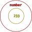
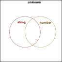
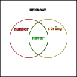
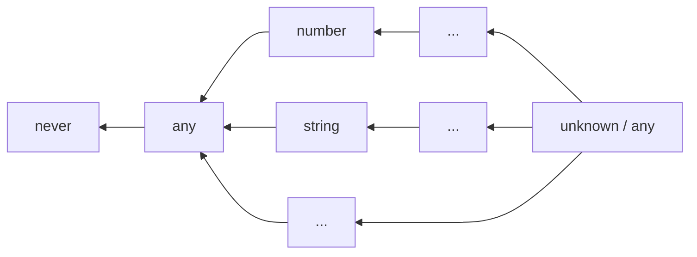
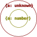
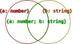

- [类型兼容](#类型兼容)
  - [向下兼容](#向下兼容)
- [集合的角度](#集合的角度)
  - [维恩图](#维恩图)
  - [认识 `as` 、`extends` 、`infer`](#认识-as-extends-infer)
- [类型断言 `as`](#类型断言-as)
  - [充分重叠](#充分重叠)
  - [`unknown`](#unknown)
  - [`number | string`](#number--string)
  - [`number & string`](#number--string-1)
  - [`as` 的成立条件](#as-的成立条件)
  - [`never`](#never)
  - [`&` 和 `|` 以及超集和子集](#-和--以及超集和子集)
  - [`any`](#any)
- [结构化类型](#结构化类型)
  - [记录类型](#记录类型)
    - [记录类型的交集](#记录类型的交集)
    - [`{}`](#)
  - [数组类型](#数组类型)
  - [元组类型](#元组类型)
    - [rest](#rest)
    - [元组类型的交集](#元组类型的交集)
    - [`[]`](#-1)
- [extends](#extends)
  - [泛型约束](#泛型约束)
  - [条件类型](#条件类型)
  - [条件类型的分配律](#条件类型的分配律)
  - [抑制条件类型的分配律](#抑制条件类型的分配律)
  - [`infer`](#infer)
  - [`infer ... extends ...`](#infer--extends-)
- [泛型类型与类型兼容](#泛型类型与类型兼容)
- [函数类型与类型兼容](#函数类型与类型兼容)
  - [类型参数](#类型参数)
  - [逆变](#逆变)
  - [协变](#协变)
  - [函数类型的特殊兼容](#函数类型的特殊兼容)
- [不严格的结构化类型](#不严格的结构化类型)
  - [使结构化类型变成严格的](#使结构化类型变成严格的)
    - [1. `readonly`](#1-readonly)
    - [2. `in` 和 `out`](#2-in-和-out)
- [接下来](#接下来)
- [一些经验之谈](#一些经验之谈)
  - [为什么条件类型表达式“无用”的分支总是返回 never ？](#为什么条件类型表达式无用的分支总是返回-never-)
  - [当一些特殊的类型遇到条件类型分配律](#当一些特殊的类型遇到条件类型分配律)
    - [never](#never-1)
    - [any](#any-1)
  - [判断两个结构化类型是否相等的条件类型](#判断两个结构化类型是否相等的条件类型)
    - [测试不能完全覆盖](#测试不能完全覆盖)
  - [判断一个类型是否为 `any` 的条件类型](#判断一个类型是否为-any-的条件类型)

## 类型兼容

在 TypeScript 编程中，类型兼容是最基础的一道检查机制，一旦代码中出现类型不兼容的表达式，编译就会失败。

- 赋值表达式中，右值输出到左值需要类型兼容。如下：
```typescript
const foo: 233 = 233;
const bar: number = foo;
```

- 函数调用表达式中，实参输出到形参需要类型兼容。如下：
```typescript
declare function log(x: number /*形参*/): unknown;

const foo: 233 = 233;
log(foo /*实参*/);
```

- 函数表达式中，函数体输出的类型需要兼容返回值类型。如下：
```typescript
function mysteryBox(): number {
  const foo: 233 = 233;
  return foo;
}
```

### 向下兼容 

**TypeScript 的类型兼容总是向下兼容的。**

得到输入的 A 总是要求输出的 B 拥有 A 类型的一切特性，以致于 A 能表现出的特性在实际使用中不会缺失，从而保证程序正确。

## 集合的角度

从集合的角度出发能让我们更好地理解向下兼容。

当我们把类型 T 视为集合 S 时，S 由全部的满足 T 一切特性的元素组成，S 的每一个元素都满足 T ，S 的每一个子集都满足 T 。
- 此时，将 S 的任一子集视为新的类型 T1 。T1 拥有 T 的一切特性，T1 向下兼容 T 。
- 同样的，将能够向下兼容 T 的任一类型视为新的集合 S1 。S1 满足 T ，S1 包含于 S ，S1 是 S 的子集。

由此可得，**子类型向下兼容超类型如同子集包含于超集**。

### 维恩图

我们可以用表示集合关系的维恩图，表达类型间的兼容关系。如前文出现的类型 `233` 和类型 `number` ：


- `233` 向下兼容 `number` 。
- `233` 是 `number` 的子类型，`233` 是 `number` 的子集。
- `number` 是 `233` 的超类型，`number` 是 `233` 的超集。

### 认识 `as` 、`extends` 、`infer`

本文将从类型兼容的角度，辅以集合的概念，重新认识 `as` 、`extends` 、`infer` 等 TypeScript 符号。

## 类型断言 `as`

不知道在阅读的你是否有留意过 `as` 的报错，里面提到过“两种类型不能充分重叠……”如下：
```typescript
// Conversion of type 'number' to type 'string' may be a mistake because neither type sufficiently overlaps with the other. If this was intentional, convert the expression to 'unknown' first.(2352)
// 类型 "number" 到类型 "string" 的转换可能是错误的，因为两种类型不能充分重叠。如果这是有意的，请先将表达式转换为 "unknown"。ts(2352)
233 as string;
```

### 充分重叠

如果把“充分重叠”这个词放在类型是集合的上下文中，那么就能更容易理解这些报错的含义了。

我们不妨这么认为，当集合 B 是集合 A 的子集时，集合 B 的元素选取范围就与集合 A 的元素选取范围“充分重叠”。*（如同上文维恩图所示。）*

不充分重叠的时候，意味着 A 包含有不属于 B 的元素，B 也包含有不属于 A 的元素。

显然，在我们的编程经验中， `number` 和 `string` 不是充分重叠的。这是导致 `233 as string` 报错的直接原因。

### `unknown`

同时，上文的报错提示我们，“如果这是有意的，请先将表达式转换为 "unknown"。”
```typescript
233 as unknown as string; // 编译通过
```

为什么 `as unknown as` 可以发挥作用？我们可以先分析一下 `unknown` 类型。

从[文档](https://www.typescriptlang.org/docs/handbook/type-compatibility.html#any-unknown-object-void-undefined-null-and-never-assignability)可知，任何类型都能分配给 `unknown` 。这等同于任何类型都能向下兼容 `unknown` 。

因为任何类型都向下兼容 `unknown` ，所以 **`unknown` 是任何类型的超类型！** （也是超集。）

已知，`number` 是 `unknown` 的子集，与 `unknown` 充分重叠；`string` 是 `unknown` 的子集，与 `unknown` 充分重叠。

上文的报错侧面告诉我们，**只要是充分重叠的两个类型，就能使用 `as` 完成转换。** 因此，将 `233 as unknown as string` 分成两步判断，`233 as unknown` 和 `unknown as string` 都是合法的，可以通过编译的。

如果用维恩图表示 `number` ，`string` 和 `unknown` 之间的关系，则是这样的：


- `number` 和 `string` 没有包含关系，不能充分重叠。
- `number` 是 `unknown` 的子集，与 `unknown` 充分重叠。
- `string` 是 `unknown` 的子集，与 `unknown` 充分重叠。

### `number | string`

如果将 `number` 和 `string` 的合集视为一个类型，该类型也能与 `number` 或 `string` 充分重叠。那么，该类型能否代替 `233 as unknown as string` 中的 `unknown` 发挥作用？在此之前，如何构造出这个类型呢？

TypeScript 提供了[联合类型](https://www.typescriptlang.org/docs/handbook/2/everyday-types.html#union-types)的运算符 `|` 。从语义上看，这个运算符似乎可以联合两个类型，得到他们的合集。

我们不妨用 `|` 做一次实验：
```typescript
type Chimera = number | string;

233 as Chimera as string;

const foo: Chimera = 233;
const bar: Chimera = "hello";

declare const baz: Chimera;
const qux: number = baz; // 不能向下兼容，报错了
const zoo: string = baz; // 不能向下兼容，报错了
```
- `Chimera` 代替 `233 as unknown as string` 中的 `unknown` 发挥作用了。
- `Chimera` 如同 `number` 和 `string` 共同的超类型，被 `number` 或 `string` 向下兼容，发挥着超类型的作用。
- 而 `Chimera` 不能向下兼容 `number` 或 `string` 。`number` 和 `string` 都是 `Chimera` 的真子集，`number` 或 `string` 与 `Chimera` 不相等。

由此可得 ~~（cai）~~ ，**`|` 运算符可以联合两个类型，得到他们的合集。** 同时也是他们的共同超类型。而且，在 `as` 表达式中，只要一边是超类型就能使其合法。

### `number & string`

同样的，如果将 `number` 和 `string` 的交集视为一个类型，该类型也能与 `number` 或 `string` 充分重叠。那么，该类型能否代替 `233 as unknown as string` 中的 `unknown` 发挥作用？在此之前，如何构造出这个类型呢？

TypeScript 提供了[交叉类型](https://www.typescriptlang.org/docs/handbook/2/objects.html#intersection-types)的运算符 `&` 。从语义上看，这个运算符似乎可以交叉两个类型，得到他们的交集。

我们不妨用 `&` 做一次实验：
```typescript
type Chimera = number & string;

233 as Chimera as string;

const foo: Chimera = 233; // 不能向下兼容，报错了
const bar: Chimera = "hello"; // 不能向下兼容，报错了

declare const baz: Chimera;
const qux: number = baz;
const zoo: string = baz;
```
- `Chimera` 代替 `233 as unknown as string` 中的 `unknown` 发挥作用了。
- `number` 和 `string` 都不能向下兼容 `Chimera` 。
- 而 `Chimera` 如同 `number` 和 `string` 共同的子类型，可以向下兼容 `number` 或 `string` ，发挥着子类型的作用。

由此可得，**`&` 运算符可以交叉两个类型，得到他们的交集。** 同时也是他们的共同子类型。而且，在 `as` 表达式中，只要一边是子类型就能使其合法。

### `as` 的成立条件

类型断言（ `as` ）的[文档](https://www.typescriptlang.org/zh/docs/handbook/2/everyday-types.html#type-assertions)有那么一句话：

> TypeScript only allows type assertions which convert to a more specific or less specific version of a type.

其中，**more specific** 和 **less specific** ，字面意思是更具体和更不具体，也许可以用大家更熟悉的词汇代替，**更具体**和**更抽象**。

如此之后，引用的句子可以翻译为：

> 类型断言只能把类型转换成更具体或更抽象的版本。

结合前文，我们不妨认为，*类型更具体的版本* 和他的子类型是等价的，*类型更抽象的版本* 和他的超类型是等价的。

由此可得，`as` 运算符两边的类型，只有在它们存在集合间的包含关系才能够成立。

### `never`

在 `type Chimera = number & string` 的举例中，TypeScript 会将其推导成 `type Chimera = never` ：
- `number` 和 `string` 的交集是 `never` ！？
- `as never as` 难道和 `as unknown as` 一样，能用于通用的类型转换？

从[文档](https://www.typescriptlang.org/docs/handbook/type-compatibility.html#any-unknown-object-void-undefined-null-and-never-assignability)可知，`never` 可以分配给任何类型。这等同于 `never` 能向下兼容任何类型。

因为 `never` 能向下兼容任何类型，所以 **`never` 是任何类型的子类型！** 在集合论中，空集是任何集合的子集。我们不妨认为 `never` 和空集是等价的。

因此，`number` 和 `string` 的交集是 `never` 时，意味着 `number` 和 `string` 没有任何相同的元素。或者说不存在一个元素能同时具备 `number` 和 `string` 的特性。这很符合我们的编程经验。

因为 `unknown` 与任何类型“充分重叠”，所以 `as unknown as` 能用于通用的类型转换。而作为任何类型的子类型的 `never` ，无疑与任何类型“充分重叠”，所以 `as never as` 能用于通用的类型转换。

如果用维恩图表示 `number` ，`string` ，`unknown` ，`never` 之间的关系，则是这样的：


- `number` & `string` 为 `never` 。
- `number` 和 `string` 都是 `unknown` 的子集。

### `&` 和 `|` 以及超集和子集

如果我们让 `never` 和 `number` 再次相交，如同一个集合和它的超集相交。根据集合的性质，得到的交集就会是该集合本身。如下：
```typescript
type foo = never & number; // type foo = never
type bar = never & string; // type bar = never
```
- `&` 表现出求交集的运算。
- `never` 与任何类型相交都会得到 `never` 。

而一个集合和它的子集合并，得到的并集就是该集合本身。如下：
```typescript
type foo = unknown | number; // type foo = unknown
type bar = unknown | string; // type bar = unknown
```
- `|` 表现出求交集的运算。
- `unknown` 与任何类型合并都会得到 `unknown` 。

同样的：
```typescript
type foo = never | number; // type foo = number
type bar = unknown & string; // type bar = string
```

如果结合了上文维恩图的包含关系，那么就能更容易理解 `&` 和 `|` 在类型上的运算。

### `any`

前面提及过任何类型的超集 `unknown` 和任何类型的子集 `never` ，那另一个跟任何类型密切相关的 `any` 呢？如何从集合的角度去看待他与其他类型的包含关系。

`any` 太特殊了，我无法用集合的语言表达。~~维恩图不会画了。~~

但我可以从包含途径出发，画出以下图表：

- 箭头左边的项包含于右边的项。
- `any` 在 TypeScript 中可以兼容 `never` 以外任何的类型，我们不妨认为他是 `never` 以外任何类型的子类型，同时也是任何类型的超类型。因此上图有两个 `any` 。

## 结构化类型

重新认识 extends 之前，我们有必要了解[结构化类型](https://www.typescriptlang.org/docs/handbook/type-compatibility.html)。

> TypeScript 的结构化类型系统是根据 JavaScript 代码的典型写法设计的。

JavaScript 广泛使用了函数表达式和对象字面量，结构化类型就是针对这点设计的，他们在字面表达上有非常相似的地方。

而结构化类型的字面表达，与泛型类型、条件类型，类型推导等类型操作关系密切。

常见的结构化类型有以下几种。

1. 基元类型 ( [Primitives](https://www.typescriptlang.org/zh/docs/handbook/2/everyday-types.html) )

基元类型就是那些平坦的字面值类型，`string` ，`number` ，`boolean` 等等。

2. 记录类型（ [Record / Object Types](https://www.typescriptlang.org/docs/handbook/2/objects.html) ）

记录是一系列属性的组合。如下：
```typescript
let foo: { name: string; age: number }; // 属性表达式
let bar: { [index in string]: number }; // 索引签名表达式

foo = { name: "foo", age: 23 };
bar = { x: 233 };
```

也有人称之为对象类型，但是我为了消除歧义，更愿意称之为记录类型。

3. 数组类型（ [Array](https://www.typescriptlang.org/docs/handbook/2/objects.html) ）

数组类型就是数组的类型。如下：
```typescript
let foo: number[];

foo = [1, 2, 3];
```

4. 元组类型（ [Tuple](https://www.typescriptlang.org/docs/handbook/2/objects.html#tuple-types) ）

元组是一系列属性的排列，在 TypeScript 中元组也属于数组的一种。如下：
```typescript
let foo: [name: string, age: number];
let bar: [string, number]; // 省略属性名的形式。

foo = ["foo", 23]; // 元组类型特性在于属性的排列分布，属性名只是记号，不存在于元组值中。
bar = ["bar", 33];
```

5. 函数类型（ [Function](https://www.typescriptlang.org/docs/handbook/2/functions.html) ）

函数类型就是函数的类型。如下：
```typescript
let foo: (x: string) => unknown;

foo = (x) => console.log(x);
```

结构化类型在分配时，也是需要向下兼容的。我们接下来谈谈其中几个在类型兼容方面的表现。

*（谈论之前或许还需要一个前提，结构化类型所表达的值是不可变的、无状态的。这样可以避免过早考虑逆变的问题。）*

### 记录类型

记录通过属性名对外输出属性。直观上，两个记录类型若要存在兼容关系：
- 子类型拥有超类型的一切同名属性。
- 子类型的同名属性一一向下兼容超类型的同名属性。

如下：
```typescript
declare let foo: { a: number; b: string };
declare let bar: { a: number };
declare let baz: { a: unknown };

baz = bar = foo;

foo = bar = baz; // 不能向下兼容，报错了
```
- `{ a: number }` 拥有 `{ a: unknown }` 同名属性 `a` ，同名属性类型 `number` 向下兼容 `unknown` ，因此 `{ a: number }` 向下兼容 `{ a: unknown }` 。
- `{ a: number; b: string }` 拥有 `{ a: number }` 的同名属性 `a` ，同名属性类型相同，类型相同即相互向下兼容。因此 `{ a: number; b: string }` 向下兼容 `{ a: number }` 。
- 反之则不能向下兼容。

#### 记录类型的交集

两个集合的交集是它们的共同子集。当这些集合代表记录类型时，意味着两个记录类型相交得到的共同子类型，拥有它们的一切属性。而子类型中名字重复的属性，它们的类型将两两相交，以致于能同时向下兼容两个超类型的对应属性。

在文档对交叉类型的[介绍](https://www.typescriptlang.org/docs/handbook/2/objects.html#intersection-types)中，运算符 `&` 本来就是用于组合多个记录类型。

如下：
```typescript
type Chimera = { a: unknown; b: string } & { a: number };

declare let foo: { a: number; b: string };
declare let bar: Chimera;

bar = foo;
foo = bar;
```
- `Chimera` 拥有 `{ a: unknown; b: string }` 和 `{ a: number }` 的一切属性 `a` 和 `b` 。
- 同名属性 `a` 的类型由 `unknown` 和 `number` 两两相交而得。
- 综上，`Chimera` 至少拥有 `a: number` 和 `b: string` 两个属性，将向下兼容 `{ a: number; b: string }` 。

当两个集合互为子集时，两个集合相等。同样的，**当两个类型互为子类型时，也就是相互向下兼容时，两个类型相等**。

因此 `{ a: unknown; b: string } & { a: number }` 等同于 `{ a: number; b: string }` 。

相关维恩图：





#### `{}`

`{}` 是一个没有任何属性的组合，显然他的类型会被任何记录类型向下兼容，是任何记录类型的超类型。

如下：
```typescript
declare let foo: { a: number };
declare let bar: { b: string };
declare let baz: {};

baz = foo;
baz = bar;
```

特别的，JavaScript 里非 `null` / `undefined` 的值，都能像 JavaScript 对象那样访问属性。反映在 TypeScript 中，类型 `{}` 是非 `null` / `undefined` 值类型的超类型。

如下：
```typescript
type foo = {} & null; // type foo = never
type bar = {} & undefined; // type bar = never

type baz = {} & number; // type baz = number
type qux = {} & string; // type qux = string
```
- 通过求交集的方式，得出 `{}` 与 `null` / `undefined` 没有包含关系。
- 通过求交集的方式，得出 `{}` 是 `number` / `string` 的超集、超类型。

*（ typescript-eslint 认为 `{}` 代表着非空的值，不是大众预期的“空对象”，从而[不推荐使用](https://github.com/typescript-eslint/typescript-eslint/issues/2063#issuecomment-675156492)。）*

有两个问题留给大家思考：
1. JavaScript 的 `number` 经过装箱成为 `Number` 对象后，能表现出 JavaScript 对象的性质。请问，在 TypeScript 中 `number` 和 `Number` 的兼容关系是怎样的？
2. 如何定义出一个“空对象”类型，使得任何带有属性的记录类型不能向下兼容它。

### 数组类型

数组对外输出元素，数组类型的向下兼容体现在元素类型的向下兼容。如下：
```typescript
declare let foo: number[];
declare let bar: unknown[];

bar = foo;
foo = bar; // 不能向下兼容，报错了
```
- `number` 向下兼容 `unknown` ，`number[]` 便向下兼容 `unknown[]` 。
- 反之则不能向下兼容。

特别的 `unknown` 是任何类型的超类型，`unknown[]` 即是任何数组类型的超类型。


### 元组类型

元组通过排列顺序输出属性。直观上，两个元组类型若要存在兼容关系：
- 子类型的属性排列结构与超类型完全对应。
- 子类型与超类型排列对应的属性，其类型一一向下兼容。

如下：
```typescript
declare let foo: [number, string];
declare let bar: [number];
declare let baz: [unknown];

bar = foo; // 不能向下兼容，报错了
baz = bar;

foo = bar; // 不能向下兼容，报错了
bar = baz; // 不能向下兼容，报错了
```
- `[number, string]` 和 `[number]` 的属性排列结构不同，因此不能向下兼容。
- `[number]` 和 `[unknown]` 是相同的排列，`number` 向下兼容排列对应的 `unknown` ，因此 `[number]` 向下兼容 `[unknown]` 。

相关维恩图：


#### rest

元组类型支持 rest 表达式，存在包含关系的两个元组类型，其属性数量不一定是相等的。

如下：
```typescript
declare const foo: [number, boolean, string];
declare const bar: [number, string];
declare const baz: [string];
declare let qux: [...unknown[], string];

qux = foo;
qux = bar;
qux = baz;
```
- `[number, boolean, string]` ，`[number, string]` 和 `[string]` 之间并不存在兼容关系。
- 但是他们都向下兼容 `[...unknown[], string]` 。而 `[...unknown[], string]` 并没有固定的属性数量。

#### 元组类型的交集

属性的排列结构显然是相斥的，而结构不同的两个元组类型的交集确实是 `never` ，是空集。如果结构相同的两个元组类型相交，每个对应的属性类型将两两相交，以致于能同时向下兼容两个超类型的对应属性。

如下：
```typescript
type Chimera1 = [number, string] & [unknown]; // Chimera = never
type Chimera2 = [number] & [unknown];

declare let foo: Chimera2;
declare let bar: [number];

bar = foo;
foo = bar;
```
- `[number, string]` 与 `[unknown]` 不相交，排列结构相斥。
- `[number] & [unknown]` 等同于 `[number]` 。

#### `[]`

`[]` 是一个没有任何属性的排列，与记录类型的共同超类型 `{}` 不同，元组类型的共同超类型不是 `[]` 。元组类型的共同超类型应该是 `[...unknown[]]` ，简化可得 `unknown[]` 。

如下：
```typescript
declare let foo: [number, string];
declare let bar: [number];
declare let baz: unknown[];

baz = foo;
baz = bar;
```

## extends

在 TypeScript 中，有好几种表达式使用了 `extends` 这个关键字，而且具体作用各不相同。但他们都有相似的地方，如果 `extends` 左右两边都是类型，左边的类型将向下兼容右边的类型。

### 泛型约束

在泛型函数或泛型类型中，泛型参数列表中的 `extends` 可以约束泛型参数的类型，使得输出到泛型参数的类型必须向下兼容 `extends` 所约束的类型。这种约束被称为[泛型约束](https://www.typescriptlang.org/docs/handbook/2/generics.html#generic-constraints)。

如下：
```typescript
declare const foo: { a: number; b: string };

function bar<T extends { a: number }>(x: T) {
  const baz: number = x.a;
}

bar(foo);
```
- 上文中的泛型约束是 `T extends { a: number }` ，输出到 `T` 的类型必须向下兼容 `{ a: number }` 。
- `{ a: number; b: string }` 向下兼容 `{ a: number }` ，因此实参 `bar` 的类型向下兼容形参 `x` 的类型 `T` ，可以合法输入。
- 因为泛型约束，所以在函数定义的上下文中，`T` 确定向下兼容 `{ a: number }` ，所以类型是 `T` 的参数 `x` 可以合法输出属性 `a` 。

泛型约束除了带来了泛型参数的类型限制，还为当前上下文带来了泛型参数的超类型信息。

### 条件类型

[条件类型](https://www.typescriptlang.org/zh/docs/handbook/2/conditional-types.html)一般出现在泛型函数或泛型类型中，是构造新类型的一种手段。他的表达式与[条件表达式](https://developer.mozilla.org/zh-CN/docs/Web/JavaScript/Reference/Operators/Conditional_Operator)的形式很像，只是条件部分被固定为 `extends` 断言，当 `extends` 左右两边的向下兼容成立，就计算并返回第一条分支，反之则第二条分支。

如下：
```typescript
type BelongToNumber<T> = T extends number ? true : false;

type Foo = BelongToNumber<1>; // type Foo = true
type Bar = BelongToNumber<string>; // type Bar = false
```
- `BelongToNumber<T>` 就是条件类型，他需要输入具体的泛型参数才能具化成特定的结构化类型。
- 类型 `1` 向下兼容 `number` ，因此 `BelongToNumber<1>` 得到第一条分支的结果 `true`。
- 类型 `string` 不向下兼容 `number` ，因此 `BelongToNumber<string>` 得到第二条分支的结果 `false`。

`(A extends B ? first : second)` 如此形式的表达式，我为了方便讲述称之为*条件类型表达式*。并且称 `A` 为*条件类型表达式的子类型*，称 `B` 为*条件类型表达式的超类型*。

### 条件类型的分配律

当我们把联合类型作为泛型参数输入条件类型时，只要该泛型参数直接出现在*条件类型表达式的子类型*上，条件类型就会呈现出[分配律](https://www.typescriptlang.org/docs/handbook/2/conditional-types.html#distributive-conditional-types)。

分配律，简单地说就是，条件类型 `T<A | B>` 会按照 `T<A> | T<B>` 的方式进行解释。

如下：
```typescript
type BelongToNumber<T> = T extends number ? true : false;

type Foo = BelongToNumber<1 | string>; // type Foo = boolean
type Bar = true | false; // type Bar = boolean
```
- 泛型参数 `T` 直接出现在条件类型表达式的子类型上。
- `BelongToNumber<1 | string>` 按照 `BelongToNumber<1> | BelongToNumber<string>` 的方式进行解释。
- `boolean` 只有两种取值可能 `true` 或 `false` ，将他们视为集合时，`boolean` 是 `true` 和 `false` 的合集。因此 `true | false` 会得到 `boolean` 。

分配律就是你们想的那种分配律，如乘法分配律， `(A + B) × C = A × C + B × C` 。乃至于，条件类型 `T<A | B, C | D>` 有可能得到 `T<A, C> | T<A, D> | T<B, C> | T<B, D>` 。

如下：
```typescript
type Orthrus<A, B> = A extends unknown
  ? B extends unknown
    ? [A, B]
    : never
  : never;

type Foo = Orthrus<"A" | "B", "C" | "D">; // type Foo = ["A", "C"] | ["A", "D"] | ["B", "C"] | ["B", "D"]
```
- 条件类型表达式允许嵌套表达。
- 泛型参数 `A` 和 `B` 都直接出现在条件类型表达式的子类型上。
- `Orthrus<"A" | "B", "C" | "D">` 呈现了分配律。

如果只有泛型参数 `A` 直接出现在条件类型表达式的子类型上呢？如下：
```typescript
type Orthrus<A, B> = A extends unknown ? [A, B] : never;

type Foo = Orthrus<"A" | "B", "C" | "D">; // type Foo = ["A", "C" | "D"] | ["B", "C" | "D"]
```
- 同样呈现出了分配律。

### 抑制条件类型的分配律

有些时候我们并不希望条件类型呈现分配律。当泛型参数需要出现在条件类型表达式的子类型上时，可以将其类型参数在该位置上构造成其他类型，使其不再直接出现，从而导致分配律失效。

如下：
```typescript
type BelongToNumber2<T> = T | number extends number ? true : false;
// type BelongToNumber2<T> = [T] extends [number] ? true : false;
// type BelongToNumber2<T> = T[] extends number[] ? true : false;
// type BelongToNumber2<T> = { x: T } extends { x: number } ? true : false;

type Foo = BelongToNumber2<1>; // type Foo = true
type Bar = BelongToNumber2<string>; // type Bar = false
type Baz = BelongToNumber2<1 | string>; // type Baz = false
type Qux = BelongToNumber2<1 | 2>; // type Qux = true
```
- 泛型参数 `T` 在条件类型表达式的子类型上被构造成其他类型，不再直接出现。
- 以上条件类型 `BelongToNumber2<T>` 的几种构造方式，都能抑制条件类型的分配律，使其将泛型参数完整地输入。
- 而改造了子类型部分的类型后，需要对超类型部分进行对应的改造，使其表达出原来的类型兼容关系。

通过构造成元组类型来抑制条件类型的分配律是最简单直接的方式，也是官方文档所推崇的方式。

### `infer`

条件类型最神奇的组件就是 `infer` ，他的语义是推断，能帮助我们推断出结构化类型的组成元素的类型。

`infer` 只能出现在*条件类型表达式的超类型*上，能作为超类型的字面表达式中的类型，并借此推断子类型的字面表达式中对应的类型。当条件类型表达式的兼容关系成立，就能在其第一条分支上使用推断得到的类型。

如下：
```typescript
type Orthrus1<T> = T extends { a: infer X } ? X : never;
type Foo = Orthrus1<{ a: number; b: string }>; // type Foo = number
type Bar = Orthrus1<{ b: string }>; // type Bar = never

type Orthrus2<T> = T extends [infer X, string] ? X : never;
type Baz = Orthrus2<[number, string]>; // type Baz = number
type Qux = Orthrus2<[number]>; // type Qux = never
```
在条件类型 `Orthrus1<T>` 中：
- `T extends { a: infer X }` 表示，当 `T` 是 `{ a: unknown}` 的子类型时，`X` 将被推断为类型 `T` 字面表达式中所对应的属性 `a` 的类型。
- 当输出到泛型参数 `T` 的类型是 `{ a: number; b: string }` 时，`X` 被推断为 `{ a: number; b: string }` 所对应的属性 `a` 的类型 `number` 。同时也是满足了条件类型的断言，计算并返回第一条分支。
- 当输出到泛型参数 `T` 的类型是 `{ b: string }` 时，`{ b:string}` 不能向下兼容 `{ a: unknown}` 。条件类型表达式的断言不成立，因此直接计算并返回第二条分支。

在条件类型 `Orthrus2<T>` 中：
- `T extends [infer X, string]` 表示，当 `T` 是 `[unknown, string]` 的子类型时，`X` 将被推断为类型 `T` 字面表达式中所对应的位置的类型。
- 当输出到泛型参数 `T` 的类型是 `[number, string]` 时，`X` 被推断为 `[number, string]` 所对应的位置的类型 `number` 。同时也是满足了条件类型的断言，计算并返回第一条分支。
- 当输出到泛型参数 `T` 的类型是 `[number]` 时，`[number]` 不能向下兼容 `[unknown, string]` 。条件类型表达式的断言不成立，因此直接计算并返回第二条分支。

当你意识到结构化类型的字面表达是条件类型中的构成之一，意识到 `infer` 推断的是结构化类型的字面表达中被其取代的类型，就能迅速地掌握 `infer` 这个关键字。

### `infer ... extends ...`

我们不难看出用 `infer X` 推断类型的时候，其实还隐含了一条泛型约束，那就是 `X extends unknown` 。只有 `X` 是 `unknown` 的子类型而不是别的具体类型的子类型，`X` 才能替代条件类型表达式的超类型的字面表达式中的任意类型。

而 `infer` 也支持显式的泛型约束。不仅约束条件类型表达式的向下兼容断言，还为当前上下文提供被推断类型的超类型信息。

如下：
```typescript
type Orthrus<T> = T extends { a: infer X extends number } ? X : never;

type Foo = Orthrus<{ a: number; b: string }>; // type Foo = number
type Bar = Orthrus<{ a: boolean; b: string }>; // type Bar = never
```
- 条件类型表达式的超类型是 `{ a: infer X extends number }` 。意味着，子类型部分需要向下兼容 `{ a: number }` ，才能完成 `infer` 的推断，才能计算并返回第一条分支。
- `{ a: number; b: string }` 向下兼容 `{ a: number }` ，因此 `X` 被推断为 `{ a: number; b: string }` 中属性 `a` 的类型 `number` ，然后在第一条分支返回 `X` 作为结果，最后 `Foo` 得到 `number` 。
- `{ a: boolean; b: string }` 不能向下兼容 `{ a: number }`，因此在第二条分支返回 `never` 作为结果，最后 `Bar` 得到 `never` 。

> 还为当前上下文提供被推断类型的超类型信息。

这属于技巧类的应用，此处不赘述。

## 泛型类型与类型兼容

泛型类型在输入所有具体的泛型参数后，可以实例化成具体的结构化类型。此时的结构化类型才能够进行分配，谈论类型兼容才有意义。

```typescript
type MysteryBox<T> = T;

declare const foo: MysteryBox; // 未实例化的泛型类型无法作为变量的类型，报错了

declare let bar: MysteryBox<number>;
declare let baz: MysteryBox<unknown>;

baz = bar;
bar = baz; // 不能向下兼容，报错了
```
- `MysteryBox` 不能直接作为变量的类型。
- `MysteryBox<number>` 向下兼容了 `MysteryBox<unknown>` 。

特别的， `MysteryBox<number>` 向下兼容 `MysteryBox<unknown>` ，本质上是他们的计算结果 `number` 向下兼容了 `unknown` 。与泛型参数之间的兼容关系没有直接关系。

可以举一个反例，使得 `T<number>` 不能向下兼容 `T<unknown>` 。如下：
```typescript
type MysteryBox<T> = { func: (x: T) => unknown };

declare let foo: MysteryBox<number>;
declare let bar: MysteryBox<unknown>;

bar = foo; // 不能向下兼容，报错了
foo = bar;
```
- `MysteryBox<number>` 不能向下兼容 `MysteryBox<unknown>` ，是因为 `(x: number) => unknown` 不能向下兼容 `(x: unknown) => unknown` 。
- `MysteryBox<unknown>` 向下兼容 `MysteryBox<number>` ，是因为 `(x: unknown) => unknown` 向下兼容 `(x: number) => unknown` 。

可见泛型参数之间能够向下兼容，不代表泛型类型计算出来的类型能够向下兼容。

## 函数类型与类型兼容

函数类型的向下兼容似乎有些奇怪呢。仅从函数参数来看，上文参数 `x` 的类型 `unknown` 能兼容对应位置的 `number` ，不同于向下兼容。这是因为该类型参数是逆变的。

### 类型参数

类型参数是抽象的，当我们需要分析结构化类型中某个元素的类型，可以将该类型当作是一个参数，名曰类型参数。就像泛型参数做的那样。

函数类型的类型参数可以分为两种，一种位于函数参数列表作为参数类型，一种位于返回值签名作为返回值类型。

用泛型类型辅助说明会更清晰，如下：
```typescript
type MysteryBox<In, Out> = (x: In) => Out;

type Foo = MysteryBox<number, unknown>; // type Foo = (x: number) => unknown
```
- `MysteryBox<In, Out>` 的泛型参数 `In` 对应位于函数参数列表的类型参数；泛型参数 `Out` 对应位于返回值签名的类型参数。
- 与 `MysteryBox<In, Out>` 对应的 `(x: number) => unknown` ，位于函数参数列表的类型参数的实际类型是 `number`；位于返回值签名的类型参数的实际类型是 `unknown` 。

### 逆变

在函数类型中，位于函数参数列表的类型参数，他的类型分配方向，与函数类型本身的类型分配方向相反，这种表现被称为是逆变的。

如下：
```typescript
declare let foo: (x: unknown) => unknown;
declare let bar: (x: number) => unknown;
declare let baz: 233;

bar = foo;

bar(baz);
```
- 沿着参数输入的方向，参数类型 `233` 分配给 `number` 分配给 `unknown` 。类型的合法分配依旧要满足向下兼容。
- 沿着函数赋值的方向，函数类型 `(x: unknown) => unknown` 分配给 `(x: number) => unknown` 。合法的分配，表现出了向下兼容。

如此看来，类型依旧是向下兼容的。只不过，位于函数参数列表的类型参数是逆变的，随着函数类型本身向着超类型分配时，他允许向着自己的子类型进行分配。

### 协变

在函数类型中，位于返回值签名的类型参数，他的类型分配方向，与函数类型本身的类型分配方向一致，这种表现被称为是协变的。

如下：
```typescript
declare let foo: () => 233;
declare let bar: () => number;
declare let baz: unknown;

bar = foo;
baz = bar();
```
- 沿着返回值输出的方向，参数类型 `233` 分配给 `number` 分配给 `unknown` 。类型分配满足向下兼容。
- 沿着函数赋值的方向，函数类型 `() => 233` 分配给 `() => number` 。合法的分配，表现出了向下兼容。

直观的，位于返回值签名的类型参数是协变的，随着函数类型本身向着超类型分配时，他允许向着自己的超类型进行分配。

### 函数类型的特殊兼容

在 JavaScript 中，函数调用时可以输入比该函数形参数量更多的实参。TypeScript 的函数类型在分配时，也考虑到了这个情况，函数列表允许“前缀兼容”。

如下：
```typescript
declare let foo: (a: number) => unknown;
declare let bar: (a: number, b: string) => unknown;

bar = foo;
foo = bar; // 不能向下兼容，报错了
```
- 与逆变相似，函数参数列表的数量可以随着输入的方向变少，在该方向上向下兼容。

## 不严格的结构化类型

上文我们谈论过的那些不平坦的结构化类型，如记录类型，数组类型，元组类型。他们的类型参数实际上在上文被认为是协变的。

但这需要一个前提：
> 结构化类型所表达的值是不可变的、无状态的。

现实世界的 TypeScript 编程，可变的、有状态的结构化类型才是常态，此时的协变会带来隐藏的陷阱。

如下：
```typescript
const foo: { x: number } = { x: 233 };

const trap1: { x: unknown } = foo;
trap1.x = "bad";

foo.x.toPrecision();

// ----
const bar: number[] = [233];

const trap2: unknown[] = bar;
trap2[0] = "bad";

bar[0].toPrecision();

// ----
const baz: [number] = [233];

const trap3: [unknown] = baz;
trap3[0] = "bad";

baz[0].toPrecision();
```
[Playground Link](https://www.typescriptlang.org/play?#code/MYewdgzgLgBAZiEAuGBvGAPFYCuBbAIwFMAnGAXxgF41MUAmAZkYoG4BYAKC9ElihIBDAA4BGFOiwwcYANZgQAdzAVq8RB04CRogHQY1AIgKCAJoc1cEIfbqggACiSLAAlhFfgAFAEpLnAHoAmABaMJCecGgYExJsfGISAG0AXTUkpkYU-15o7WF6FBl5JTBUtVjNfPokgAY0mmMzCy4uWLqUu0dnNw9vP1bA4PCIzlzYEwAvFCTcQlIGmAzmbMHxmHzGGeKFZUWpqqFhRg6jE3N-KY6upxd3TzBfViA)

- 他们的类型参数都是协变的，如 `{ x: number }` 中属性 `x` 的类型，从 `number` 协变为 `unknown` 。
- 他们通过赋值改变部分属性的值，而且是合法的类型分配。如将 `bad` 赋值给 属性 `x` ，类型 `string` 分配给 `unknown` 。
- 他们最终会使用被修改过的属性，调用该值的 `toPrecision` 函数。

以上代码都能成功编译，但很显然，从上下文就能推断出代码必然报错。

实际运行中，把 `string` 当作 `number` 调用 `toPrecision` 函数，最终会因为 `string` 在装箱成 `String` 时缺少对应的函数而报错。

默认状态下，结构化类型在类型分配上存在缺陷，因此他是不严格的。

### 使结构化类型变成严格的

有两种方法使结构化类型变成严格的。

#### 1. `readonly`

在结构化类型中使用 [`readonly`](https://www.typescriptlang.org/docs/handbook/2/objects.html#readonly-properties) 关键字，使得类型参数都是对外输出的。此时类型参数的分配方向，始终和结构化类型的分配方向一致，语义上真正做到了协变。

如下：
```typescript
const foo: { readonly x: number } = { x: 233 };

const trap1: { readonly x: unknown } = foo;
trap1.x = "bad"; // 不可赋值，报错了

foo.x.toPrecision();

// ----
const bar: readonly number[] = [233];

const trap2: readonly unknown[] = bar;
trap2[0] = "bad"; // 不可赋值，报错了

bar[0].toPrecision();

// ----
const baz: readonly [number] = [233];

const trap3: readonly [unknown] = baz;
trap3[0] = "bad"; // 不可赋值，报错了

baz[0].toPrecision();
```
[Playground Link](https://www.typescriptlang.org/play?#code/MYewdgzgLgBAZiEAuGBvGAnApgQwCbgA2AnjAB4pgCuAtgEZYYwC+MAvGuSgEwDMvLANwBYAFBjQkWFAw4ADgEYU6bPiKkKMKmADWYEAHcwLdvEQjRM+QoB0ZUwCI6+B4JgB6dzECwcoHvlQNKxgDwKgDD-gKVGgJipgGFyYmIIIHY2UCAACtjAAJYQ6eAAFACUFmKeMAC0ZSUS4NAwzhgoqgRgJDDU9IwA2gC6pu18vJ2FopLVVnLc9biNzdp6hmBdprUWo9ztAAzdHE4ubsV+QWFRMaK1652JKWmZ2WD5g8XlFUNVsM4AXhNqTaTtrQwYmxgvX4A2Ow2ksjkvE+Ux+M30RkB72WkN4Z0czjwrg8Xn2IQi0XEJxwbzOF1SWAyWVyBSAA)

- 属性的只读阻止了他的值被修改，始终保持原来的类型。

当结构化类型所表达的值是不可变的、无状态的时候，就可以阻止赋值，从根本上避免输入不兼容类型的值。

#### 2. `in` 和 `out`

在泛型参数中使用 [`in` 或 `out`](https://www.typescriptlang.org/docs/handbook/release-notes/typescript-4-7.html#optional-variance-annotations-for-type-parameters) 关键字，使得类型参数显式带有逆变或协变的性质。此时，泛型类型的实例在分配时，相应的类型参数必须符合指定的可变性。

单独看待结构化类型的属性的赋值（输入）行为，他的类型参数的分配方向与该结构化类型的分配方向相反，应当是逆变的，因此需要标注 `in` 。而属性的读取（输出），显然是协变的，因此需要标注 `out` 。如下：

```typescript
type MysteryBox<in out T> = { x: T };

const foo: MysteryBox<number> = { x: 233 };

const trap: MysteryBox<unknown> = foo; // 不可赋值，报错了
trap.x = "bad";

foo.x.toPrecision();
```
[Playground Link](https://www.typescriptlang.org/play?#code/C4TwDgpgBAsiDOwICcQCED2APAPASwDsoMBXYKAFQD4oBeKAbyiwC5KoBfAbgFgAofgGMMBRFABmGDGziIU6bDgIkAtgCMUNek1ZQATAGYDnXgL7DR5YMgCGYGQiSpMuEgQDWBDAHcCWiVJcUAD0wVCAsHKA98qA0rGAPAqAMP+ApUaAmKmAYXL81nYAdFh0UABEajYAJvmm-JIYOVnAGAAKyBCCePB4IgAUAJRcQA)

- 由于泛型参数 `T` 要求同时具备逆变（ `in` ）和协变（ `out` ）的性质，只有不变化才能同时满足这两点。这种不变化又称抗变。
- 由于 `T` 的抗变，`MysteryBox<number>` 不能分配给 `MysteryBox<unknown>` 。

当结构化类型根据他的属性用途显式标注他的可变性时，就能在类型进行分配或者说转换时，提前让编译器暴露类型不兼容的错误。

可惜，直到 TypeScript 4.8.4 的现在，可变性标注的使用仍有非常多的限制，此处不表。目前比较实用的用途是，规范泛型 class 的类型兼容，避免掉入类型兼容的陷阱。

## 接下来

其实到这里，本文已经谈论了 TypeScript 非常大的一部分跟类型操作相关的内容。接下来读者可以去了解如何对泛型类型和条件类型进行复合的运用，如嵌套的，递归的表达等。篇幅有限，不再展开。

## 一些经验之谈

关于条件类型，我还有一些想法不吐不快。

### 为什么条件类型表达式“无用”的分支总是返回 never ？

为什么条件类型表达式“无用”的分支总是返回 `never` ？上文关于 `infer` 的举例也是这样，返回 `unknown` 表示未知的类型可以吗？

因为条件类型的分配律呀。如果条件类型呈现分配律就会对“中间结果”做联合运算（ `|` ），而任何类型与 `never` 联合，如同任何集合与空集合并，得到的是该类型本身。这样一来，条件类型呈现分配律时，得到的“中间结果”为 `never` 的项将会被“忽略”。

如果不是刻意避免，条件类型很容易就带有分配律性质，此时对“无用”的分支返回 `never` 是一个不容易出错且合乎直观的选择。

值得一提的是，[Utility Types](https://www.typescriptlang.org/docs/handbook/utility-types.html) 就有一些条件类型利用了 `never` 完成对联合类型的“缩小/具体化”。如下：
```typescript
type Exclude<T, U> = T extends U ? never : T;
type Extract<T, U> = T extends U ? T : never;
```

那么，如果发生在递归的条件类型中，总是对最终结果做交叉运算时，“无用”的分支返回 `unknown` 也许是更合适的选择。

### 当一些特殊的类型遇到条件类型分配律

条件类型分配律有几处奇怪的地方。

#### never

当条件类型能够呈现分配律时，输入 `never` 总会输出 `never` 。

如下：
```typescript
type Orthrus1<T> = T extends never ? true : false;
type Orthrus2<T> = never extends T ? true : false;

type Foo = Orthrus1<never>; // type Foo = never
type Bar = Orthrus2<never>; // type Bar = true
```
- `Foo` 既不是第一条分支的 `true` ，也不是第二条分支的 `false` ，而是 `never` 。

#### any

当条件类型能够呈现分配律时，输入 `any` 能同时联合两条分支的结果。

如下：
```typescript
type Orthrus<T> = T extends 233 ? 22 : 33;

type Foo = Orthrus<any>; // type Foo = 22 | 33
```

### 判断两个结构化类型是否相等的条件类型

上文已经出现过判断两个结构化类型相等的方法：
> 当两个集合互为子集时，两个集合相等。同样的，**当两个类型互为子类型时，也就是相互向下兼容时，两个类型相等**。

如果据此构造出条件类型 `Equal<A, B>` ，并抑制条件类型分布律。那么就能得到：
```typescript
type Equal<A, B> = [A] extends [B] ? ([B] extends [A] ? true : false) : false;
```

目前的 TypeScript 对类型进行 `|` 或 `&` ，不总是得到最终的类型，而是显示成联合类型或交叉类型的表达式。

如下：
```typescript
type Foo = { a: unknown; b: string } & { a: number };
type Bar = [number] & [unknown];
type Baz = { a: number } | { a: unknown };
type Qux = [number] | [unknown];
```
[Playground Link](https://www.typescriptlang.org/play?#code/C4TwDgpgBAYg9nKBeKBvKBDAXFArgOwGt84B3fAbigCMcBnYAJwEt8BzKAXygDI1Mc+XAFtqERlwoBYAFChIUAEIYJKANpDR4gLq8oagsTL5t0ueGjKAXsn7YomsRO4AfOzkMlyk2fOgBFXAAPWw0RJ103AyIvEwogA)

但有了 `Equal<A, B>` 就能方便地测试这些结构化类型是否与预期的类型相等。如下：
```typescript
type Equal<A, B> = [A] extends [B] ? ([B] extends [A] ? true : false) : false;

type Foo = Equal<
  { a: unknown; b: string } & { a: number },
  { a: number; b: string }
>; // type Foo = true
type Bar = Equal<[number] & [unknown], [number]>; // type Bar = true
type Baz = Equal<{ a: number } | { a: unknown }, { a: unknown }>; // type Baz = true
type Qux = Equal<[number] | [unknown], [unknown]>; // type Qux = true
```

#### 测试不能完全覆盖

这样的条件类型 `Equal<A, B>` 实际上没有覆盖所有的测试用例，最简单的例子是 `Equal<any, 233>` 返回 `true` 。除此之外，还有：
```typescript
type Equal<A, B> = [A] extends [B] ? ([B] extends [A] ? true : false) : false;

type Foo = Equal<{ x?: unknown }, {}>; // type Foo = true
type Bar = Equal<(x?: unknown) => unknown, () => unknown>; // type Bar = true
```
- 以及更多的测试用例，此处不表。

还有相关的[讨论](https://github.com/microsoft/TypeScript/issues/27024)。在讨论里，是另一种实现的测试覆盖更全面，也更受欢迎。

但我认为从集合理论出发实现的 `Equal<A, B>` 才是更合理的。

对于不能覆盖 `any` 的表现， `any` 语义本来就是能充当任何类型，因此我认为 `Equal<any, 233>` 返回 `true` 也是合理的。至于其他测试用例，我更偏向于 TypeScript 的实现不够完善。

### 判断一个类型是否为 `any` 的条件类型

这个条件类型的实现非常有意思：
```typescript
type IsAny<T> = 0 extends 1 & T ? true : false;
```
- 从集合角度看待，`0` 和 `1` 的交集是空集，所以不存在一个包含 `0` 的集合与 `1` 的交集包含 `0` 。
- 其中包含 `0` 的集合，是 `0` 的超集、超类型，所以不存在一个类型可以使 `0 extends 1 & T` 这个断言成立。

> `any` 是 `never` 以外任何类型的子类型，同时也是任何类型的超类型。

但是，从结果倒推，`any` 与 `1` 相交得到他们的共同子类型 `any` ，`any` 是 `0` 的超类型。因此，`any` 可以使 `0 extends 1 & T` 这个断言成立。