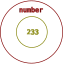
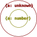

- [类型兼容](#类型兼容)
  - [向下兼容](#向下兼容)
- [集合的角度](#集合的角度)
  - [维恩图](#维恩图)
  - [认识 `as` 、`extends` 、`infer`](#认识-as-extends-infer)
- [类型断言 `as`](#类型断言-as)
  - [充分重叠](#充分重叠)
  - [`unknown`](#unknown)
  - [`number | string`](#number--string)
  - [`number & string`](#number--string-1)
  - [`as` 的成立条件](#as-的成立条件)
  - [`never`](#never)
  - [`&` 和 `|` 以及超集和子集](#-和--以及超集和子集)
  - [`any`](#any)
- [结构化类型](#结构化类型)
  - [记录类型](#记录类型)
    - [记录类型的交集](#记录类型的交集)
    - [`{}`](#)
  - [数组类型](#数组类型)

## 类型兼容

在 TypeScript 编程中，类型兼容是最基础的一道检查机制，一旦代码中出现类型不兼容的表达式，编译就会失败。

- 赋值表达式中，右值输出到左值需要类型兼容。如下：
```typescript
const foo: 233 = 233;
const bar: number = foo;
```

- 函数调用表达式中，实参输出到形参需要类型兼容。如下：
```typescript
declare function log(x: number /*形参*/): void;

const foo: 233 = 233;
log(foo /*实参*/);
```

- 函数表达式中，输出的返回值类型需要兼容函数返回类型。如下：
```typescript
function mysteryBox(): number {
  const foo: 233 = 233;
  return foo;
}
```

### 向下兼容 
**TypeScript 的类型兼容总是向下兼容的。**

得到输入的 A 总是要求输出的 B 拥有 A 类型的一切特性，以致于 A 能表现出的特性在实际使用中不会缺失，从而保证程序正确。

## 集合的角度

从集合的角度出发能让我们更好地理解向下兼容。

当我们把类型 T 视为集合 S 时，S 由全部的满足 T 一切特性的元素组成，S 的每一个元素都满足 T ，S 的每一个子集都满足 T 。
- 此时，将 S 的任一子集视为新的类型 T1 。T1 拥有 T 的一切特性，T1 向下兼容 T 。
- 同样的，将能够向下兼容 T 的任一类型视为新的集合 S1 。S1 满足 T ，S1 包含于 S ，S1 是 S 的子集。

由此可得，**子类型向下兼容超类型如同子集包含于超集**。

### 维恩图

我们可以用表示集合关系的维恩图，表达类型间的兼容关系。如前文出现的 `233` 类型和 `number` 类型：

- `233` 向下兼容 `number` 。
- `233` 是 `number` 的子类型，`233` 是 `number` 的子集。
- `number` 是 `233` 的超类型，`number` 是 `233` 的超集。

### 认识 `as` 、`extends` 、`infer`

本文将从类型兼容的角度，辅以集合的概念，重新认识 `as` 、`extends` 、`infer` 等 TypeScript 符号。

## 类型断言 `as`

不知道在阅读的你是否有留意过 `as` 的报错，里面提到过“两种类型不能充分重叠……”如下：
```typescript
// Conversion of type 'number' to type 'string' may be a mistake because neither type sufficiently overlaps with the other. If this was intentional, convert the expression to 'unknown' first.(2352)
// 类型 "number" 到类型 "string" 的转换可能是错误的，因为两种类型不能充分重叠。如果这是有意的，请先将表达式转换为 "unknown"。ts(2352)
233 as string;
```

### 充分重叠

如果把“充分重叠”这个词放在类型是集合的上下文中，那么就能更容易理解这些报错的含义了。

我们不妨这么认为，当集合 B 是集合 A 的子集时，集合 B 的元素选取范围就与集合 A 的元素选取范围“充分重叠”。*（如同上文维恩图所示。）*

不充分重叠的时候，意味着 A 包含有不属于 B 的元素，B 也包含有不属于 A 的元素。

显然，在我们的编程经验中， `number` 和 `string` 不是充分重叠的。这是导致 `233 as string` 报错的直接原因。

### `unknown`

同时，上文的报错提示我们，“如果这是有意的，请先将表达式转换为 "unknown"。”
```typescript
233 as unknown as string; // 编译通过
```

为什么 `as unknown` 可以发挥作用？我们可以先分析一下 `unknown` 类型。

从[文档](https://www.typescriptlang.org/docs/handbook/type-compatibility.html#any-unknown-object-void-undefined-null-and-never-assignability)可知，任何类型都能分配给 `unknown` 。这等同于任何类型都能向下兼容 `unknown` 。

因为任何类型都向下兼容 `unknown` ，所以 **`unknown` 是任何类型的超类型！** （也是超集。）

已知，`number` 是 `unknown` 的子集，与 `unknown` 充分重叠；`string` 是 `unknown` 的子集，与 `unknown` 充分重叠。

上文的报错侧面告诉我们，**只要是充分重叠的两个类型，就能使用 `as` 完成转换。** 因此，将 `233 as unknown as string` 分成两步判断，`233 as unknown` 和 `unknown as string` 都是合法的，可以通过编译的。

如果用维恩图表示 `number` ，`string` 和 `unknown` 之间的关系，则是这样的：

- `number` 和 `string` 没有包含关系，不能充分重叠，。
- `number` 是 `unknown` 的子集，与 `unknown` 充分重叠。
- `string` 是 `unknown` 的子集，与 `unknown` 充分重叠。

### `number | string`

如果将 `number` 和 `string` 的合集视为一个类型，该类型也能与 `number` 或 `string` 充分重叠。那么，该类型能否代替 `233 as unknown as string` 中的 `unknown` 发挥作用？在此之前，如何构造出这个类型呢？

TypeScript 提供了[联合类型](https://www.typescriptlang.org/docs/handbook/2/everyday-types.html#union-types)的运算符 `|` 。从语义上看，这个运算符似乎可以联合两个类型，得到他们的合集。

我们不妨用 `|` 做一次实验：
```typescript
type Chimera = number | string;

233 as Chimera as string;

const foo: Chimera = 233;
const bar: Chimera = "hello";

declare const baz: Chimera;
const qux: number = baz; // 不能向下兼容，报错了
const zoo: string = baz; // 不能向下兼容，报错了
```
- `Chimera` 代替 `233 as unknown as string` 中的 `unknown` 发挥作用了。
- `Chimera` 如同 `number` 和 `string` 共同的超类型，被 `number` 或 `string` 向下兼容，发挥着超类型的作用。
- 而 `Chimera` 不能向下兼容 `number` 或 `string` 。`number` 和 `string` 都是 `Chimera` 的真子集，`number` 或 `string` 与 `Chimera` 不相等。

由此可得 ~~（cai）~~ ，**`|` 运算符可以联合两个类型，得到他们的合集。** 同时也是他们的共同超类型。而且，在 `as` 表达式中，只要一边是超类型就能使其合法。

### `number & string`

同样的，如果将 `number` 和 `string` 的交集视为一个类型，该类型也能与 `number` 或 `string` 充分重叠。那么，该类型能否代替 `233 as unknown as string` 中的 `unknown` 发挥作用？在此之前，如何构造出这个类型呢？

TypeScript 提供了[交叉类型](https://www.typescriptlang.org/docs/handbook/2/objects.html#intersection-types)的运算符 `&` 。从语义上看，这个运算符似乎可以交叉两个类型，得到他们的交集。

我们不妨用 `&` 做一次实验：
```typescript
type Chimera = number & string;

233 as Chimera as string;

const foo: Chimera = 233; // 不能向下兼容，报错了
const bar: Chimera = "hello"; // 不能向下兼容，报错了

declare const baz: Chimera;
const qux: number = baz;
const zoo: string = baz;
```
- `Chimera` 代替 `233 as unknown as string` 中的 `unknown` 发挥作用了。
- `number` 和 `string` 都不能向下兼容 `Chimera` 。
- 而 `Chimera` 如同 `number` 和 `string` 共同的子类型，可以向下兼容 `number` 或 `string` ，发挥着子类型的作用。

由此可得，**`&` 运算符可以交叉两个类型，得到他们的交集。** 同时也是他们的共同子类型。而且，在 `as` 表达式中，只要一边是子类型就能使其合法。

### `as` 的成立条件

类型断言（ `as` ）的[文档](https://www.typescriptlang.org/zh/docs/handbook/2/everyday-types.html#type-assertions)有那么一句话：

> TypeScript only allows type assertions which convert to a more specific or less specific version of a type.

其中，**more specific** 和 **less specific** ，字面意思是更具体和更不具体，也许可以用大家更熟悉的词汇代替，**更具体**和**更抽象**。

如此之后，引用的句子可以翻译为：

> 类型断言只能把类型转换成更具体或更抽象的版本。

结合前文，我们不妨认为，*类型更具体的版本* 和他的子类型是等价的，*类型更抽象的版本* 和他的超类型是等价的。

由此可得，`as` 运算符两边的类型，只有在它们存在集合间的包含关系才能够成立。

### `never`

在 `type Chimera = number & string` 的举例中，TypeScript 会将其推导成 `type Chimera = never` ：
- `number` 和 `string` 的交集是 `never` ！？
- `as never` 难道和 `as unknown` 一样，能用于通用的类型转换？

从[文档](https://www.typescriptlang.org/docs/handbook/type-compatibility.html#any-unknown-object-void-undefined-null-and-never-assignability)可知，`never` 可以分配给任何类型。这等同于 `never` 能向下兼容任何类型。

因为 `never` 能向下兼容任何类型，所以 **`never` 是任何类型的子类型！** 在集合论中，空集是任何集合的子集。我们不妨认为 `never` 和空集是等价的。

因此，`number` 和 `string` 的交集是 `never` 时，意味着 `number` 和 `string` 没有任何相同的元素。或者说不存在一个元素能同时具备 `number` 和 `string` 的特性。这很符合我们的编程经验。

如果用维恩图表示 `number` ，`string` ，`unknown` ，`never` 之间的关系，则是这样的：

- `number` & `string` 为 `never` 。
- `number` 和 `string` 都是 `unknown` 的子集。

### `&` 和 `|` 以及超集和子集

如果我们让 `never` 和 `number` 再次相交，如同一个集合和它的超集相交。根据集合的性质，得到的交集就会是该集合本身。如下：
```typescript
type foo = never & number; // type foo = never
type bar = never & string; // type bar = never
```
- `&` 表现出求交集的运算。
- `never` 与任何类型相交都会得到 `never` 。

而一个集合和它的子集合并，得到的并集就是该集合本身。如下：
```typescript
type foo = unknown | number; // type foo = unknown
type bar = unknown | string; // type bar = unknown
```
- `|` 表现出求交集的运算。
- `unknown` 与任何类型合并都会得到 `unknown` 。

同样的：
```typescript
type foo = never | number; // type foo = number
type bar = unknown & string; // type bar = string
```

如果结合了上文维恩图的包含关系，那么就能更容易理解 `&` 和 `|` 在类型上的运算。

### `any`

前面提及过任何类型的超集 `unknown` 和任何类型的子集 `never` ，那另一个跟任何类型密切相关的 `any` 呢？如何从集合的角度去看待他与其他类型的包含关系。

`any` 太特殊了，我无法用集合的语言表达。~~维恩图不会画了。~~

但我可以从包含途径出发，画出以下图表：

- 箭头左边的项包含于右边的项。
- `any` 在 TypeScript 中可以兼容 `never` 以外所有的类型，我们不妨认为他是 `never` 以外所有类型的子集，同时也是所有类型的超集。因此上图有两个 `any` 。

## 结构化类型

重新认识 extends 之前，我们有必要了解[结构化类型](https://www.typescriptlang.org/docs/handbook/type-compatibility.html)。

> TypeScript 的结构化类型系统是根据 JavaScript 代码的典型写法设计的。

JavaScript 广泛使用了函数表达式和对象字面量，结构化类型就是针对这点设计的，他们在字面表达上有非常相似的地方。

而结构化类型的字面表达，与泛型类型、条件类型，类型推导等类型操作关系密切。

常见的结构化类型有以下几种。

1. 基元类型 ( [Primitives](https://www.typescriptlang.org/zh/docs/handbook/2/everyday-types.html) )

基元类型就是那些平坦的字面值类型，`string` ，`number` ，`boolean` 等等。

2. 记录类型（ [Record / Object Types](https://www.typescriptlang.org/docs/handbook/2/objects.html) ）

记录是一系列属性的组合。如下：
```typescript
let foo: { name: string; age: number }; // 属性表达式
let bar: { [index in string]: number }; // 索引签名表达式

foo = { name: "foo", age: 23 };
bar = { x: 233 };
```

也有人称之为对象类型，但是我为了消除歧义，更愿意称之为记录类型。

3. 数组类型（ [Array](https://www.typescriptlang.org/docs/handbook/2/objects.html) ）

数组类型就是数组的类型。如下：
```typescript
let foo: number[];

foo = [1, 2, 3];
```

4. 元组类型（ [Tuple](https://www.typescriptlang.org/docs/handbook/2/objects.html#tuple-types) ）

元组是一系列属性的排列，在 TypeScript 中元组也属于数组的一种。如下：
```typescript
let foo: [name: string, age: number];
let bar: [string, number]; // 省略属性名的形式。

foo = ["foo", 23]; // 元组类型特性在于属性的排列分布，属性名只是记号，不存在于元组值中。
bar = ["bar", 33];
```

5. 函数类型（ [Function](https://www.typescriptlang.org/docs/handbook/2/functions.html) ）

函数类型就是函数的类型。如下：
```typescript
let foo: (x: string) => void;

foo = (x) => console.log(x);
```

结构化类型在分配时，也是需要向下兼容的。我们接下来谈谈其中几个在类型兼容方面的表现。

*（谈论之前或许还需要一个前提，结构化类型所表达的值是不可变的、无状态的。这样可以避免过早考虑逆变的问题。）*

### 记录类型

记录通过属性名对外输出属性。直观上，两个记录类型若是存在向下兼容关系：
- 子类型拥有超类型的一切同名属性。
- 子类型的同名属性一一向下兼容超类型的同名属性。

```typescript
declare let foo: { a: number; b: string };
declare let bar: { a: number };
declare let baz: { a: unknown };

baz = bar = foo;

foo = bar = baz; // 不能向下兼容，报错了
```
- `{ a: number }` 拥有 `{ a: unknown }` 同名属性 `a` ，同名属性类型 `number` 向下兼容 `unknown` ，因此 `{ a: number }` 向下兼容 `{ a: unknown }` 。
- `{ a: number; b: string }` 拥有 `{ a: number }` 的同名属性 `a` ，同名属性类型相同，类型相同将相互向下兼容。因此 `{ a: number; b: string }` 向下兼容 `{ a: number }` 。
- 反之则不能向下兼容。

#### 记录类型的交集

两个集合的交集是它们的共同子集。当这些集合代表记录类型时，意味着两个记录类型相交得到的共同子类型，拥有它们的一切属性。而子类型中名字重复的属性，它们的类型将两两相交。

在文档对交叉类型的[介绍](https://www.typescriptlang.org/docs/handbook/2/objects.html#intersection-types)中，运算符 `&` 本来就是用于组合多个记录类型。

我们可以看一个简单的例子：
```typescript
type Chimera = { a: unknown; b: string } & { a: number };

declare let foo: { a: number; b: string };
declare let bar: Chimera;

foo = bar;
bar = foo;
```
- `Chimera` 拥有 `{ a: unknown; b: string }` 和 `{ a: number }` 的一切属性 `a` 和 `b` 。
- 同名属性 `a` 的类型由 `unknown` 和 `number` 两两相交而得。
- 综上，`Chimera` 至少拥有 `a: number` 和 `b: string` 两个属性，将向下兼容 `{ a: number; b: string }` 。

当两个集合互为子集时，两个集合相等。同样的，**当两个类型互为子类型时，也就是相互向下兼容时，两个类型相等**。

因此 `{ a: unknown; b: string } & { a: number }` 等同于 `{ a: number; b: string }` 。

相关维恩图：




#### `{}`

`{}` 是一个没有任何属性的组合，显然他的类型会被任何记录类型向下兼容，是所有记录类型的超类型。

举一些简单的例子：
```typescript
declare let foo: { a: number };
declare let bar: { b: string };
declare let baz: {};

baz = foo;
baz = bar;

foo = baz; // 不能向下兼容，报错了
bar = baz; // 不能向下兼容，报错了
```

特别的，JavaScript 里非 `null` / `undefined` 的值，都能像 JavaScript 对象那样访问属性。反映在 TypeScript 中，类型 `{}` 是非 `null` / `undefined` 值类型的超类型。

举一些简单的例子：
```typescript
type foo = {} & null; // type foo = never
type bar = {} & undefined; // type bar = never

type baz = {} & number; // type baz = number
type qux = {} & string; // type qux = string
```
- 通过求交集的方式，得出 `{}` 与 `null` / `undefined` 没有包含关系。
- 通过求交集的方式，得出 `{}` 是 `number` / `string` 的超集、超类型。

*（ typescript-eslint 认为 `{}` 代表着非空的值，不是大众预期的“空对象”，从而[不推荐使用](https://github.com/typescript-eslint/typescript-eslint/issues/2063#issuecomment-675156492)。）*

有两个问题留给大家思考：
1. JavaScript 的 `number` 经过装箱成为 `Number` 对象后，能表现出 JavaScript 对象的性质。请问，在 TypeScript 中 `number` 和 `Number` 的兼容关系是怎样的？
2. 如何定义出一个“空对象”类型，使得任何带有属性的记录类型不能向下兼容它。

### 数组类型

数组对外输出元素，数组类型的向下兼容体现在元素类型的向下兼容。如下：
```typescript
declare let foo: number[];
declare let bar: unknown[];

bar = foo;
foo = bar; // 不能向下兼容，报错了
```
- `number` 向下兼容 `unknown` ，`number[]` 便向下兼容 `unknown[]` 。
- 反之则不能向下兼容。

特别的 `unknown` 是任何类型的超类型，`unknown[]` 即是任何数组类型的超类型。

