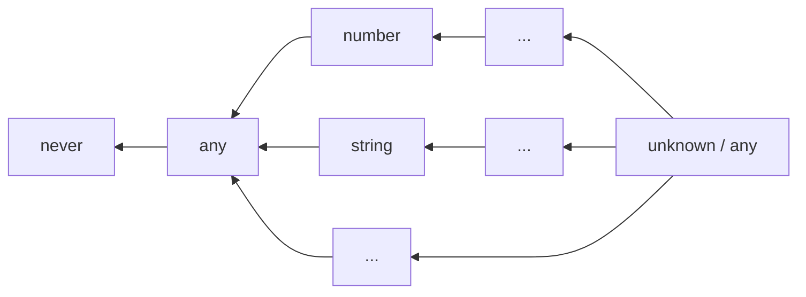

## 向下兼容

类型兼容体现在 typescript 使用过程中的方方面面。如：

- 赋值语句中的向下兼容。

```typescript
const foo: "some value" = "some value";
const bar: string = foo;
```

- 函数传参时的向下兼容

```typescript
declare function log(x: string): void;

const foo: "some value" = "some value";
log(foo);
```

- 函数返回时的向下兼容。

```typescript
function mysteryBox(): string {
  const foo: "some value" = "some value";
  return foo;
}
```

而这些不同的形式，其实都是类型兼容在**赋值**行为上的表现，他要求发起赋值对象的类型，必须向下兼容被赋值对象的类型。

在我看来，如果 B 在代码中出现的地方，都能用 A 去代替而不会编译出错，那么 A 就是向下兼容 B 。至于更准确的描述，请阅读官方文档[Type Compatibility](https://www.typescriptlang.org/docs/handbook/type-compatibility.html)。

## 集合的角度

有一个角度能很好地理解类型的向下兼容，就是把类型视作是一个个集合。当 A 类型是 B 类型的子集时，就是 A 向下兼容 B 。


- "some value" 向下兼容 string
- "some value" 向下兼容 "some value"
- string 向下兼容 string

从集合角度出发也有助于理解[联合类型（|）](https://www.typescriptlang.org/docs/handbook/2/everyday-types.html#union-types)和[交叉类型（&）](https://www.typescriptlang.org/docs/handbook/2/objects.html#intersection-types)，以及泛型使用中出现的 extends 和 infer 关键字。

本文后续将围绕着集合进行展开，可是为什么本文不叫从集合开始？有的概念，其实用集合会太过抽象，反而不好理解。如协变和逆变。

~~其实是标题有集合会比较劝退~~

## 类型断言 as

不知道在阅读的你是否有留意过 as 的报错，里面提到过“两种类型不能充分重叠……”

```typescript
// Conversion of type 'number' to type 'string' may be a mistake because neither type sufficiently overlaps with the other. If this was intentional, convert the expression to 'unknown' first.(2352)
// 类型 "number" 到类型 "string" 的转换可能是错误的，因为两种类型不能充分重叠。如果这是有意的，请先将表达式转换为 "unknown"。ts(2352)
233 as string;
```

如果把“充分重叠”这个词放在类型是集合的上下文中，那么就能更容易理解前面报错的含义了。

我们不妨这么认为，当集合 B 是集合 A 的子集时，集合 B 的元素选取范围就与集合 A 的元素选取范围“充分重叠”。

不充分重叠的时候，意味着 A 包含有不属于 B 的元素，B 也包含有不属于 A 的元素。

显然，在我们的编程经验中， string 和 number 不是充分重叠的。

### unknown

从[文档](https://www.typescriptlang.org/docs/handbook/type-compatibility.html#any-unknown-object-void-undefined-null-and-never-assignability)可知，所有类型都能分配给 unknown 。我们可以将 unknown 视作所有类型的超集/父集。


已知集合 number 和集合 string 都分别是集合 unknown 的子集，因此可以通过 unknown 来完成一次有意的转换。

```typescript
// 编译器没有报错
233 as unknown as string;
```

这似乎就能解释 `as unknown` 能发挥作用的原因。

在集合论中，一个集合和它的父集进行联合，结果是它的父集。这一点在 typescript 通过 `|` 也能体现出来。

```typescript
type r1 = number | unknown; // type r1 = unknown
type r2 = string | unknown; // type r2 = unknown
```
*（由于某些原因，即使是有充分重叠的可能， | 运算往往得到的是字面表达式，而不是其中的父集。这些在后文会有交代。）*

### number & string

number 和 string 交叉的部分，也是能分别和 number/string 充分重叠，是否能进行 as 转换呢？

```typescript
type Chimera = number & string;
// 编译器没有报错
233 as Chimera as string;
```

成功了。

其实在编辑器中，鼠标悬停 Chimera 的结果是 `type Chimera = never` 。

number 和 string 的交叉是 never ！[文档](https://www.typescriptlang.org/docs/handbook/type-compatibility.html#any-unknown-object-void-undefined-null-and-never-assignability)有说明 never 可以分配给任意类型。如果从集合的角度看待，never 就是空集，空集是任何集合的子集。

交叉是 never 意味着，number 和 string 没有任何相同的元素，这很符合我们的编程经验。


一个集合和它的子集进行交叉，结果是它的子集。这一点在 typescript 通过 `&` 也能体现出来。

```typescript
type r1 = number & never; // type r1 = never
type r2 = string & never; // type r2 = never
```
*（当然，由于某些原因，& 运算往往得到是字面表达式。）*

### as 的成立条件

> TypeScript only allows type assertions which convert to a more specific or less specific version of a type.

结合[文档](https://www.typescriptlang.org/zh/docs/handbook/2/everyday-types.html#type-assertions)，从集合的角度出发，我们可以得到个结论。

as 运算符两边的类型，只有在它们之间存在包含的关系才能够成立。

### any 呢

any 太特殊了，我无法用集合的语言表达。~~维恩图不会画了。~~

但可以从包含途径出发，画一张图表。


*（箭头左边的项包含于右边的项。）*

any 并不向下兼容 never 。
```typescript
declare const foo: any;
// 不能将类型“any”分配给类型“never”。ts(2322)
const bar: never = foo;
```