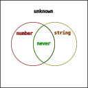
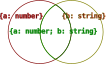

- [向下兼容](#向下兼容)
- [集合的角度](#集合的角度)
- [类型断言 as](#类型断言-as)
  - [unknown](#unknown)
  - [number | string](#number--string)
  - [number & string](#number--string-1)
  - [never](#never)
  - [as 的成立条件](#as-的成立条件)
  - [any](#any)
- [结构化类型](#结构化类型)
  - [记录类型](#记录类型)
  - [数组类型](#数组类型)
  - [元组类型](#元组类型)
- [extends](#extends)
  - [泛型约束](#泛型约束)
  - [条件类型](#条件类型)
  - [条件类型的“分配律”](#条件类型的分配律)
  - [抑制条件类型的“分配律”](#抑制条件类型的分配律)
  - [infer](#infer)
  - [infer ... extends ...](#infer--extends-)
- [关于类型体操](#关于类型体操)
- [一些经验之谈](#一些经验之谈)
  - [为什么条件类型表达式“无用”的分支总是返回 never ？](#为什么条件类型表达式无用的分支总是返回-never-)

## 向下兼容

类型兼容在 TypeScript 编程中无处不在。如：

- 赋值表达式中，右值输出到左值需要类型兼容。如下：
```typescript
const foo: "some value" = "some value";
const bar: string = foo;
```

- 函数调用表达式中，实参输出到形参需要类型兼容。如下：
```typescript
declare function log(x: string /*形参*/): void;

const foo: "some value" = "some value";
log(foo /*实参*/);
```

- 函数定义中，输出的返回值需要兼容已定义的返回类型。如下：
```typescript
function mysteryBox(): string {
  const foo: "some value" = "some value";
  return foo;
}
```

TypeScript 的类型兼容总是向下兼容的。得到输入的 A 总是要求输出的 B 拥有 A 类型的一切特性，以致于 A 能表现出的特性在实际使用中不会缺失，从而保证程序正确。

## 集合的角度

从集合的角度出发能让我们更好地理解向下兼容。

当我们把类型 T 视为集合 S 时，S 由全部的满足 T 一切特性的元素组成，S 的每一个元素都满足 T ，S 的每一个子集都满足 T 。此时将 S 的任一子集视为新的类型 T1 ，T1 拥有 T 的一切特性，T1 向下兼容 T 。同样的，将能够向下兼容 T 的任一类型视为新的集合 S1 ，S1 满足 T ，被 S 包含，S1 是 S 的子集。

由此可得，**子类型向下兼容超类型如同子集包含于超集**。

我们可以把前面出现过的 `"some value"` 类型和 `string` 类型画进用以表示集合关系的维恩图里。


`"some value"` 是 `string` 的子集，`"some value"` 向下兼容 `string` 。

理解类型兼容是理解 `as` 、`extends` 、`infer` 等符号的第一步。

## 类型断言 as

不知道在阅读的你是否有留意过 `as` 的报错，里面提到过“两种类型不能充分重叠……”如下：
```typescript
// Conversion of type 'number' to type 'string' may be a mistake because neither type sufficiently overlaps with the other. If this was intentional, convert the expression to 'unknown' first.(2352)
// 类型 "number" 到类型 "string" 的转换可能是错误的，因为两种类型不能充分重叠。如果这是有意的，请先将表达式转换为 "unknown"。ts(2352)
233 as string;
```

如果把“充分重叠”这个词放在类型是集合的上下文中，那么就能更容易理解前面报错的含义了。

我们不妨这么认为，当集合 B 是集合 A 的子集时，集合 B 的元素选取范围就与集合 A 的元素选取范围“充分重叠”。*（如同上文维恩图所示。）*

不充分重叠的时候，意味着 A 包含有不属于 B 的元素，B 也包含有不属于 A 的元素。

显然，在我们的编程经验中， `string` 和 `number` 不是充分重叠的。

### unknown

从[文档](https://www.typescriptlang.org/docs/handbook/type-compatibility.html#any-unknown-object-void-undefined-null-and-never-assignability)可知，所有类型都能分配给 `unknown` 。我们可以将 `unknown` 视为所有类型的超集。


已知集合 `number` 和集合 `string` 都分别是集合 `unknown` 的子集，都与 `unknown` 充分重叠，因此可以通过 `unknown` 来完成一次“有意的转换”。如下：
```typescript
// 编译器没有报错
233 as unknown as string;
```

这似乎就能解释 `as unknown` 能发挥作用的原因。

在集合论中，一个集合和它的超集进行联合，结果是它的超集。这一点在 TypeScript 通过 `|` 也能体现出来。如下：
```typescript
type r1 = number | unknown; // type r1 = unknown
type r2 = string | unknown; // type r2 = unknown
```
*（不知为何，即使是有充分重叠的可能， `|` 运算往往得到的是字面表达式，而不是其中的超集类型。后文再议。）*

### number | string

从集合的角度出发，`number` 和 `string` 联合得到的类型，也能与 `number` 、`string` 充分重叠。

[联合类型](https://www.typescriptlang.org/docs/handbook/2/everyday-types.html#union-types)的运算符 `|` 是否如语义那样可以联合 `number` 和 `string` ？是否能进行 `as` 转换呢？是否也能体现类型向下兼容呢？
```typescript
type Chimera = number | string;

233 as Chimera as string; // 无报错

const foo: Chimera = 233; // 无报错
const bar: Chimera = "hello"; // 无报错

declare const baz: Chimera;
const qux: number = baz; // 不能向下兼容，报错了
const zoo: string = baz; // 不能向下兼容，报错了
```

如上，成功通过 `Chimera` 进行了转换。作为子集的 `number` 、`string` 都向下兼容了超集 `Chimera` ；作为超集的 `Chimera` 不能向下兼容它的子集 `number` 、`string` 。

### number & string

从集合的角度出发，`number` 和 `string` 交叉的部分，也能与 `number` 、`string` 充分重叠。

[交叉类型](https://www.typescriptlang.org/docs/handbook/2/objects.html#intersection-types)的运算符 `&` 是否如语义那样可以交叉 `number` 和 `string` ？是否能进行 `as` 转换呢？是否也能体现类型向下兼容呢？
```typescript
type Chimera = number & string;

233 as Chimera as string; // 无报错

declare const baz: Chimera;
const qux: number = baz; // 无报错
const zoo: string = baz; // 无报错

const foo: Chimera = 233; // 不能向下兼容，报错了
const bar: Chimera = "hello"; // 不能向下兼容，报错了
```

如上，成功通过 `Chimera` 进行了转换；作为子集的 `Chimera` 向下兼容了超集 `number` 、`string` ；作为超集的 `number` 、`string` 不能向下兼容它的子集 `Chimera` 。

### never

其实在 `number & string` 的举例中，在 TypeScript 编辑器中，用鼠标悬停 Chimera 会显示 `type Chimera = never` 。

`number` 和 `string` 的交叉是 `never` ！

[文档](https://www.typescriptlang.org/docs/handbook/type-compatibility.html#any-unknown-object-void-undefined-null-and-never-assignability)有说明 `never` 可以分配给所有类型。如果从集合的角度看待，空集是所有集合的子集，`never` 也是所有类型的子集，不妨认为 `never` 就是空集。

交叉是 `never` 意味着，`number` 和 `string` 没有任何相同的元素，或者说不存在一个元素能同时具备 number 和 string 的性质。这很符合我们的编程经验。



一个集合和它的子集进行交叉，结果是它的子集。这一点在 TypeScript 通过 `&` 也能体现出来。如下：
```typescript
type r1 = number & never; // type r1 = never
type r2 = string & never; // type r2 = never
```
*（当然，不知为何，`&` 运算往往得到是字面表达式，即使其中有充分重叠的子集类型。后文再议。）*

### as 的成立条件

类型断言（ `as` ）的[文档](https://www.typescriptlang.org/zh/docs/handbook/2/everyday-types.html#type-assertions)有那么一句话：

> TypeScript only allows type assertions which convert to a more specific or less specific version of a type.

其中，**more specific** 和 **less specific** ，字面意思是更具体和更不具体，也许可以用大家更熟悉的词汇代替，**更具体**和**更抽象**。

如此之后，引用的句子可以翻译为：

> 类型断言只能把类型转化成更具体或更抽象的版本。

结合我们的编程经验，我们不妨认为，*类型更具体的版本*和他的子集是等价的，*类型更抽象的版本*和他的超集是等价的。

由此可得，`as` 运算符两边的类型，只有在它们存在集合间的包含关系才能够成立。

### any 

前面提到过所有类型的超集 `unknown` 和所有类型的子集 `never` ，那跟“所有类型”密切相关的 `any` 呢，如何从集合的角度看待？

`any` 太特殊了，我无法用集合的语言表达。~~维恩图不会画了。~~

但可以从包含途径出发画一张图表。


*（箭头左边的项包含于右边的项。）*

`any` 在图上出现了两次，因为它是 `never` 以外所有类型的子集，也是所有类型的超集。

特别要指出 `any` 并不向下兼容 `never` 。如下：
```typescript
declare const foo: any;
const bar: never = foo; // 不能向下兼容，报错了
```

`any` 的特殊还体现在别的方面，后文再议。

## 结构化类型

重新认识 extends 之前，我们有必要了解[结构化类型](https://www.typescriptlang.org/docs/handbook/type-compatibility.html)。

> TypeScript 的结构化类型系统是根据 JavaScript 代码的典型写法设计的。

JavaScript 广泛使用了函数表达式和对象字面量，结构化类型就是针对这点设计的，他们在字面表达上有非常相似的地方。而结构化类型的字面表达，是泛型、条件类型，类型推导……的基本构成。

常见的结构化类型有以下几种：

1. 基元类型 ( [Primitives](https://www.typescriptlang.org/zh/docs/handbook/2/everyday-types.html) )

基元类型就是那些平坦的字面值类型，`string` ，`number` ，`boolean` 等等。

2. 记录类型（ [Record / Object Types](https://www.typescriptlang.org/docs/handbook/2/objects.html) ）

记录是一系列属性的组合。如下：
```typescript
let foo: { name: string; age: number }; // 属性表达式
let bar: { [index in string]: number }; // 索引签名表达式

foo = { name: "foo", age: 23 };
bar = { x: 233 };
```

也有人称之为对象类型，但是我为了消除歧义，更愿意称之为记录类型。

3. 数组类型（ [Array](https://www.typescriptlang.org/docs/handbook/2/objects.html) ）

数组类型就是数组的类型。如下：
```typescript
let foo: number[];

foo = [1, 2, 3];
```

4. 元组类型（ [Tuple](https://www.typescriptlang.org/docs/handbook/2/objects.html#tuple-types) ）

元组是一系列属性的排列，在 TypeScript 中元组也属于数组的一种。如下：
```typescript
let foo: [name: string, age: number];
let bar: [string, number]; // 省略属性名的形式。

foo = ["foo", 23]; // 元组类型特性在于属性的排列分布，属性名只是记号，不存在于元组值中。
bar = ["bar", 33];
```

5. 函数类型（ [Function](https://www.typescriptlang.org/docs/handbook/2/functions.html) ）

函数类型就是函数的类型。如下：
```typescript
let foo: (x: string) => void;

foo = (x) => console.log(x);
```

结构化类型在分配时，也是需要向下兼容的。我们接下来谈谈其中几个在类型兼容方面的表现。

*（谈论之前或许还需要一个前提，结构化类型所表达的值是不可变的、无状态的。这样可以避免过早考虑逆变的问题。）*

### 记录类型

记录通过属性名对外输出属性，两个记录类型若是存在向下兼容关系：
- 子类型拥有超类型的一切同名属性。
- 子类型的同名属性一一向下兼容超类型的同名属性。

```typescript
declare let foo: { a: unknown };
declare let bar: { a: number };

foo = bar; // 向下兼容

declare const baz: { a: number; b: string };

bar = baz; // 向下兼容
```

- `{ a: number }` 拥有 `{ a: unknown }` 同名属性 `a` ，同名属性类型 `number` 向下兼容 `unknown` ，因此 `{ a: number }` 向下兼容 `{ a: unknown }` 。
- `{ a: number; b: string }` 拥有 `{ a: unknown }` 同名属性 `a` ，同名属性类型相同，相同类型相互向下兼容，因此 `{ a: number; b: string }` 向下兼容 `{ a: number }` 。

两个集合交叉得到的集合，是它们的共同子集。当这些集合代表记录类型时，意味着两个记录类型交叉得到的共同子类型，拥有它们的一切属性。而子类型中名字重复的属性，它们的类型将两两交叉。

在文档对交叉类型的[介绍](https://www.typescriptlang.org/docs/handbook/2/objects.html#intersection-types)中，运算符 & 本来就是用于组合多个记录类型。如下：
```typescript
type Chimera = { a: unknown } & { a: number };

declare let foo: Chimera;
declare let bar: { a: number };

foo = bar; // 向下兼容
bar = foo; // 向下兼容
```


当两个集合互为子集时，两个集合相等。同样的，当两个类型相互向下兼容时，两个类型相等。~~（没考虑 any ）~~

综上，`{ a: unknown } & { a: number }` 等同于 `{ a: number }` 。同名属性 `a` 的类型由 `unknown` 和 `number` 两两交叉而得。如下：
```typescript
type Chimera = { a: number } & { b: string };

declare let foo: Chimera;
declare let bar: { a: number; b: string };

foo = bar; // 向下兼容
bar = foo; // 向下兼容
```



`{}` 是一个没有任何属性的组合，显然他的类型会被任何记录类型向下兼容，是所有记录类型的超类型。如下：
```typescript
type Chimera = { a: number } & {}; // 编辑器里甚至直接得到 type Chimera = { a: number }
```

特别的，JavaScript 里非 `null` / `undefined` 的值，都能像 JavaScript 对象那样访问属性，如同 TypeScript 的记录类型。因此，在 TypeScript 中类型 `{}` 也是非 `null` / `undefined` 值的超集类型。如下：
```typescript
type Chimera = number & {};

declare let foo: Chimera;
declare let bar: number;

foo = bar;
bar = foo;

// Chimera 事实上是 number ，{} 是 number 的超集。

type Chimera2 = null & {}; // type Chimera2 = never
type Chimera3 = undefined & {}; // type Chimera3 = never
```

*（ typescript-eslint 认为 `{}` 代表着非空的值，不是大众预期的“空对象”，从而[不推荐](https://github.com/typescript-eslint/typescript-eslint/issues/2063#issuecomment-675156492)使用。）*

有两个问题留给大家思考：
1. JavaScript 的 `number` 经过装箱成为 `Number` 对象后，能表现出 JavaScript 对象的性质。请问，在 TypeScript 中 `number` 和 `Number` 的兼容关系是怎样的？
2. 如何定义出一个“空对象”类型，使得任何带有属性的记录类型不能向下兼容它。

### 数组类型

数组对外输出元素，数组类型的向下兼容体现在元素类型的向下兼容。如下：
```typescript
declare const foo: number[];
const bar: unknown[] = foo; // 向下兼容
```

- `number` 向下兼容 `unknown` ，`number[]` 便向下兼容 `unknown[]` 。

`unknown[]` 同样是所有数组类型的超类型。


### 元组类型

元组通过排列顺序输出属性，两个元组类型若是存在向下兼容关系：
- 子类型的属性排列结构与超类型完全对应。
- 子类型同位置属性的类型一一向下兼容超类型同位置属性的类型。

*（元组类型和记录类型似乎像排列和组合那般对称。）*

```typescript
declare let foo: [unknown];
declare let bar: [number];

foo = bar; // 向下兼容

declare const baz: [number, string];

bar = baz; // 不能向下兼容，报错了
```

- `[unknown]` 和 `[number]` 同样是只有一个属性的排列，在相同位置上 `number` 向下兼容 `unknown` ，因此 `[number]` 向下兼容 `[unknown]` 。
- `[number, string]` 和 `[number]` 的属性排列结构不同，两个元素的排列和一个元素的排列明显不同，因此 `[number, string]` 不能向下兼容 `[number]` 。


> 子类型的属性排列结构与超类型完全对应。

上述条件之所以不是“每个属性一一对应”，是因为元组类型支持 rest 表达式，需要用更广义的表达。如下：
```typescript
declare let foo: [...unknown[], string];

declare const bar: [number, string];
foo = bar; // 向下兼容

declare const baz: [string];
foo = baz; // 向下兼容

declare const qux: [number, boolean, string];
foo = qux; // 向下兼容
```

属性的排列结构显然是相斥的，因此两个结构不同的元组类型进行交叉会得到 `never` 。而相同结构的元组类型进行交叉，每个对应位置的属性将两两交叉。如下：
```typescript
type Chimera = [unknown] & [number];

declare let foo: Chimera;
declare let bar: [number];

foo = bar; // 向下兼容
bar = foo; // 向下兼容

type Chimera1 = [number] & [number, string]; // type Chimera1 = never
```

可见 `[unknown] & [number]` 等同于 `[number]` 。

`[]` 是一个没有任何属性的排列，与记录类型的超集 `{}` 不同，他与其他元组类型的交叉是 `never` 。如果要找到所有元组的共同超类型，他应该是 `[...unknown[]]` ，简化可得 `unknown[]` 。如下：
```typescript
type Chimera = [number] & unknown[];

declare let foo: Chimera;
declare let bar: [number];

foo = bar; // 向下兼容
bar = foo; // 向下兼容
```

## extends

在 TypeScript 中，有好几种表达式使用了 `extends` 这个关键字，而且具体作用各不相同。但他们都有相似的地方，如果 `extends` 左右两边都是类型，左边的类型将向下兼容右边的类型。

### 泛型约束

在泛型函数或泛型类型中，泛型参数列表中的 `extends` 可以用于约束泛型参数的类型，使得输出到泛型参数的类型必须向下兼容 `extends` 所约束的类型。这种约束被称为[泛型约束](https://www.typescriptlang.org/docs/handbook/2/generics.html#generic-constraints)。如下：
```typescript
function foo<T extends { length: number }>(x: T): T {
  const baz: number = x.length;
  return x;
}

declare const bar: { length: number; value: number };
const qux: { length: number; value: number } = foo(bar);
```

- 在 `foo` 的泛型参数列表中，类型 `T` 的泛型约束是 `{ length: number }`。使得输出到 `T` 的类型必须向下兼容 `{ length: number }` 。
- 记录类型 `{ length: number, value: number }` 向下兼容 `{ length: number }` 。因此可以 `bar` 可以作为 `foo` 的参数传入。
- 在 `foo` 函数定义的上下文中，`T` 向下兼容 `{ length: number }` 。因此类型是 `T` 的 `x` 参数，可以在 `foo` 中输出 `length` 属性。
- 而 `T` 的实际类型在 `foo` 函数定义的上下文中不会发生变化。因此 `foo(bar)` 输出的 `T` 就是由 `bar` 输出的类型，也就是 `{ length: number; value: number }` 。

### 条件类型

[条件类型](https://www.typescriptlang.org/zh/docs/handbook/2/conditional-types.html)一般出现在泛型函数或泛型类型中，是构造新类型的另一种手段。他的表达式与[条件表达式](https://developer.mozilla.org/zh-CN/docs/Web/JavaScript/Reference/Operators/Conditional_Operator)的形式很像，只是条件部分被固定为 `extends` 断言，当 `extends` 左右两边的向下兼容成立，就计算并返回第一条分支，反之第二条。如下：
```typescript
type BelongToNumber<T> = T extends number ? true : false;

type Foo = BelongToNumber<1>; // type Foo = true
type Bar = BelongToNumber<string>; // type Bar = false
```
`BelongToNumber` 就属于条件类型，他需要传入参数才能具化成某个结构化类型。
- 类型 `1` 是 `number` 的子类型，因此 `BelongToNumber<1>` 得到第一条分支的结果 `true`。
- 类型 `string` 不向下兼容 `number` ，因此 `BelongToNumber<string>` 得到第二条分支的结果 `false`。

`(A extends B ? first : second)` 如此形式的表达式，我为了方便讲述称之为*条件类型表达式*。而且我还称 `A` 为条件类型表达式子类型，称 `B` 为条件类型表达式超类型。

### 条件类型的“分配律”

当我们把联合类型作为参数传入条件类型，而他的泛型参数在条件类型表达式子类型出现过，条件类型就有可能呈现[“分配律”](https://www.typescriptlang.org/docs/handbook/2/conditional-types.html#distributive-conditional-types)。

如 `BelongToNumber<A | B>` 就会按照 `BelongToNumber<A> | BelongToNumber<B>` 的方式进行解释：
```typescript
type BelongToNumber<T> = T extends number ? true : false;

type Foo = BelongToNumber<1 | string>; // type Foo = boolean
type Bar = true | false; // type Bar = boolean
```

- 泛型参数 `T` 在条件类型表达式子类型出现过。
- `BelongToNumber<1 | string>` 按照 `BelongToNumber<1> | BelongToNumber<string>` 的方式进行解释。
- `boolean` 只有两种取值可能 `true` 或 `false` ，将他们视为集合，`boolean` 是 `true` 和 `false` 的合集。因此 `true | false` 会得到 `boolean` 。

分配律就是你们想的那种分配律，如乘法分配律， `(A + B) × C = A × C + B × C` 。乃至于，`T<A | B, C | D>` 有可能得到 `T<A, C> | T<A, D> | T<B, C> | T<B, D>`。如下：
```typescript
type Orthrus<A, B> = A extends unknown
  ? B extends unknown
    ? [A, B]
    : never
  : never;

type Foo = Orthrus<"A" | "B", "C" | "D">; // type Foo = ["A", "C"] | ["A", "D"] | ["B", "C"] | ["B", "D"]
```

- 条件类型表达式允许嵌套表达。
- 泛型参数 `A` 和 `B` 都在条件类型表达式子类型出现过。
- Orthrus<"A" | "B", "C" | "D"> 呈现了“分配律”。

如果只有参数 `A` 在条件类型表达式子类型出现过呢：
```typescript
type Orthrus<A, B> = A extends unknown ? [A, B] : never;

type Foo = Orthrus<"A" | "B", "C" | "D">; // type Foo = ["A", "C" | "D"] | ["B", "C" | "D"]
```

### 抑制条件类型的“分配律”

有些时候我们并不希望条件类型呈现“分配律”，此时可以使用某些结构化类型将泛型参数“固化”，使其在条件类型表达式子类型失去联合类型的形态，从而导致“分配律”失效。如下：

```typescript
type BelongToNumber2<T> = [T] extends [number] ? true : false; 
// type BelongToNumber2<T> = { x: T } extends { x: number } ? true : false 同样能抑制。

type Foo = BelongToNumber2<1>; // type Foo = true
type Bar = BelongToNumber2<string>; // type Bar = false
type Baz = BelongToNumber2<1 | string>; // type Baz = false
```

使用元组类型来抑制是最简洁的表达。

### infer

条件类型最神奇的组件就是 `infer` ，他的语义是推断，能帮助我们推断出结构化类型的组成元素的类型。

`infer` 只能在*条件类型表达式超类型*上出现，能替代超类型的字面表达式中的类型，作为想要推断的部分。当条件类型表达式的向下兼容关系成立，就能在其第一条分支上使用推断得到的类型。如下：
```typescript
type Foo<T> = T extends { a: infer X } ? X : never;
type foo = Foo<{ a: number; b: string }>; // type foo = number

type Bar<T> = T extends [infer X, string] ? X : never;
type bar = Bar<[number, string]>; // type bar = number
```

当你意识到结构化类型的字面表达是条件类型中的构成之一，意识到 `infer` 推断的是结构化类型的字面表达中被其取代的类型，就能迅速地掌握 `infer` 这个关键字。

### infer ... extends ...

我们不难看出用 `infer X` 推断类型的时候，其实还隐含了一条信息，就是 `X extends unknown` 的泛型约束。只有 `X` 是 `unknown` 的子类型而不是别的具体类型的子类型，`X` 才能替代条件类型表达式超类型的字面表达式中的任意类型。

而 `infer` 确实支持后缀泛型约束，如下：
```typescript
type Orthrus<T> = T extends { a: infer X extends number } ? X : never;

type Foo = Orthrus<{ a: number; b: string }>; // type Foo = number
type Bar = Orthrus<{ a: boolean; b: string }>; // type Bar = never
```

- 条件类型表达式超类型是 `{ a: infer X extends number }` 意味着，子类型部分需要向下兼容 `{ a: number }` ，才能完成 `infer` 的推断，才能计算并返回第一条分支。
- `{ a: number; b: string }` 向下兼容 `{ a: number }` ，因此 `X` 推断为 `{ a: number; b: string }` 中属性 `a` 的类型 `number` ，然后在第一条分支返回 `X` 作为结果，最后 `Foo` 得到 `number` 。
- `{ a: boolean; b: string }` 不能向下兼容 `{ a: number }`，因此在第二条分支返回 `never` 作为结果，最后 `Bar` 得到 `never` 。

## 关于类型体操

我上面已经讲了 TypeScript 非常大的一部分跟类型操作相关的内容，掌握这些已经可以对泛型进行复合的应用，如嵌套的、递归的条件类型等。如此一来，就能写出花里胡哨的、人们口中的类型体操了吧。所以我上面算是类型体操的分解动作？会不会感觉很普通？

把复杂的东西变成一个个小玩意去看待，他就会失去晦涩和神秘感吧。

## 一些经验之谈

关于条件类型，我还有一些想法不吐不快。

### 为什么条件类型表达式“无用”的分支总是返回 never ？

为什么条件类型表达式“无用”的分支总是返回 `never` ？上文关于 `infer` 的举例也是这样，返回 `unknown` 表示未知的类型可以吗？

因为条件类型的“分布律”呀。如果条件类型呈现“分布律”就会对结果做联合运算（ `|` ），而任何类型与 `never` 联合，如同任何集合与空集合并，等到的是该类型本身。如果不是刻意避免，条件类型很容易就带有“分布律”性质，此时对无用的分支返回 `never` 是一个不容易出错的选择。

值得一提的是，[Utility Types](https://www.typescriptlang.org/docs/handbook/utility-types.html) 就有一些条件类型利用了 `never` 完成对类型的“缩小/具体化”。如下：
```typescript
type Exclude<T, U> = T extends U ? never : T;
type Extract<T, U> = T extends U ? T : never;
```


