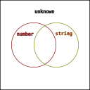

## 向下兼容

类型兼容体现在 TypeScript 使用过程中的方方面面。如：

- 赋值语句中的向下兼容。

```typescript
const foo: "some value" = "some value";
const bar: string = foo;
```

- 函数传参时的向下兼容

```typescript
declare function log(x: string): void;

const foo: "some value" = "some value";
log(foo);
```

- 函数返回时的向下兼容。

```typescript
function mysteryBox(): string {
  const foo: "some value" = "some value";
  return foo;
}
```

而这些不同的形式，其实都是类型兼容在**赋值**行为上的表现，他要求发起赋值对象的类型，必须向下兼容被赋值对象的类型。

在我看来，如果 B 在代码中出现的地方，都能用 A 去代替而不会编译出错，那么 A 就是向下兼容 B 。至于更准确的描述，请阅读官方文档 [Type Compatibility](https://www.typescriptlang.org/docs/handbook/type-compatibility.html)。

## 集合的角度

有一个角度能很好地理解类型的向下兼容，就是把类型视作是一个个集合。当 A 类型是 B 类型的子集时，就是 A 向下兼容 B 。


- "some value" 向下兼容 string
- "some value" 向下兼容 "some value"
- string 向下兼容 string

从集合角度出发也有助于理解[联合类型（|）](https://www.typescriptlang.org/docs/handbook/2/everyday-types.html#union-types)和[交叉类型（&）](https://www.typescriptlang.org/docs/handbook/2/objects.html#intersection-types)，以及泛型使用中出现的 extends 和 infer 关键字。

本文后续将围绕着集合进行展开，可是为什么本文不叫从集合开始？其实，有的概念用集合会太过抽象，反而不好理解。如协变和逆变。

~~其实是标题有集合会比较劝退~~

## 类型断言 as

不知道在阅读的你是否有留意过 as 的报错，里面提到过“两种类型不能充分重叠……”

```typescript
// Conversion of type 'number' to type 'string' may be a mistake because neither type sufficiently overlaps with the other. If this was intentional, convert the expression to 'unknown' first.(2352)
// 类型 "number" 到类型 "string" 的转换可能是错误的，因为两种类型不能充分重叠。如果这是有意的，请先将表达式转换为 "unknown"。ts(2352)
233 as string;
```

如果把“充分重叠”这个词放在类型是集合的上下文中，那么就能更容易理解前面报错的含义了。

我们不妨这么认为，当集合 B 是集合 A 的子集时，集合 B 的元素选取范围就与集合 A 的元素选取范围“充分重叠”。

不充分重叠的时候，意味着 A 包含有不属于 B 的元素，B 也包含有不属于 A 的元素。

显然，在我们的编程经验中， string 和 number 不是充分重叠的。

### unknown

从[文档](https://www.typescriptlang.org/docs/handbook/type-compatibility.html#any-unknown-object-void-undefined-null-and-never-assignability)可知，所有类型都能分配给 unknown 。我们可以将 unknown 视作所有类型的超集/父集。



已知集合 number 和集合 string 都分别是集合 unknown 的子集，都与 unknown 充分重叠，因此可以通过 unknown 来完成一次有意的转换。

```typescript
// 编译器没有报错
233 as unknown as string;
```

这似乎就能解释 `as unknown` 能发挥作用的原因。

在集合论中，一个集合和它的超集进行联合，结果是它的超集。这一点在 TypeScript 通过 `|` 也能体现出来。

```typescript
type r1 = number | unknown; // type r1 = unknown
type r2 = string | unknown; // type r2 = unknown
```
*（由于某些原因，即使是有充分重叠的可能， | 运算往往得到的是字面表达式，而不是其中的超集类型。这些在后文会有交代。）*

### number | string

从集合的角度出发，number 和 string 联合得到的类型，也能与 number/string 充分重叠。

联合类型的运算符 | 是否如语义那样可以联合 number 和 string ？是否能进行 as 转换呢？是否也能体现类型向下兼容呢？

```typescript
type Chimera = number | string;

233 as Chimera as string; // 无报错

const foo: Chimera = 233; // 无报错
const bar: Chimera = "hello"; // 无报错

declare const baz: Chimera;
const qux: number = baz; // 不能向下兼容，报错了
const zoo: string = baz; // 不能向下兼容，报错了
```

如上，成功通过 Chimera 进行了转换；作为子集的 number / string 都向下兼容了超集 Chimera ；作为超集的 Chimera 不能向下兼容它的子集 number / string。

### number & string

从集合的角度出发，number 和 string 交叉的部分，也能与 number/string 充分重叠。

交叉类型的运算符 & 是否如语义那样可以交叉 number 和 string ？是否能进行 as 转换呢？是否也能体现类型向下兼容呢？

```typescript
type Chimera = number & string;

233 as Chimera as string; // 无报错

declare const baz: Chimera;
const qux: number = baz; // 无报错
const zoo: string = baz; // 无报错

const foo: Chimera = 233; // 不能向下兼容，报错了
const bar: Chimera = "hello"; // 不能向下兼容，报错了
```

如上，成功通过 Chimera 进行了转换；作为子集的 Chimera 向下兼容了超集 number / string ；作为超集的 number/string 不能向下兼容它的子集 Chimera。

### never

其实在 number & string 的举例中，在 TypeScript 编辑器中，用鼠标悬停 Chimera 会显示 `type Chimera = never` 。

number 和 string 的交叉是 never ！

[文档](https://www.typescriptlang.org/docs/handbook/type-compatibility.html#any-unknown-object-void-undefined-null-and-never-assignability)有说明 never 可以分配给所有类型。如果从集合的角度看待，空集是所有集合的子集，never 也是所有类型的子集，不妨认为 never 就是空集。

交叉是 never 意味着，number 和 string 没有任何相同的元素，或者说不存在一个元素能同时具备 number 和 string 的性质。这很符合我们的编程经验。


一个集合和它的子集进行交叉，结果是它的子集。这一点在 TypeScript 通过 `&` 也能体现出来。

```typescript
type r1 = number & never; // type r1 = never
type r2 = string & never; // type r2 = never
```
*（当然，由于某些原因，& 运算往往得到是字面表达式，即使其中有充分重叠的子集类型。）*

### as 的成立条件

类型断言（ as ）的[文档](https://www.typescriptlang.org/zh/docs/handbook/2/everyday-types.html#type-assertions)有那么一句话：

> TypeScript only allows type assertions which convert to a more specific or less specific version of a type.

其中，**more specific** 和 **less specific** ，字面意思是更具体和更不具体，也许可以用大家更熟悉的词汇代替，**更具体**和**更抽象**。

如此之后，引用的句子可以翻译为：

> 类型断言只能把类型转化成更具体或更抽象的版本。

结合我们的编程经验，我们不妨认为，类型更具体的版本和他的子集是等价的，类型更抽象的版本和他的超集是等价的。

据此可以得出个结论：as 运算符两边的类型，只有在它们之间存在包含的关系才能够成立。

### any 

前面提到过所有类型的超集 unknown 和所有类型的子集 never ，那跟“所有类型”密切相关的 any 呢，如何从集合的角度看待？

any 太特殊了，我无法用集合的语言表达。~~维恩图不会画了。~~

但可以从包含途径出发，画一张图表。


*（箭头左边的项包含于右边的项。）*

any 在图上出现了两次，因为它是 never 以外所有类型的子集，也是所有类型的超集。

特别的，any 并不向下兼容 never 。
```typescript
declare const foo: any;
const bar: never = foo; // 不能向下兼容，报错了
```

## 结构化类型

重新认识 extends 之前，我们有必要了解[结构化类型](https://www.typescriptlang.org/docs/handbook/type-compatibility.html)。

> TypeScript 的结构化类型系统是根据 JavaScript 代码的典型写法设计的。

JavaScript 广泛使用了函数表达式和对象字面量，结构化类型就是针对这点设计的，他们在字面表达上有非常相似的地方。而结构化类型的字面表达，是泛型、条件类型，类型推导……的基本构成。

常见的结构化类型有以下几种：

1. 基本类型 ( [Primitives](https://www.typescriptlang.org/zh/docs/handbook/2/everyday-types.html) )

基本类型就是那些平坦的字面值类型，`string` ，`number` ，`boolean` 等等。

2. 记录类型（ [Record / Object Types](https://www.typescriptlang.org/docs/handbook/2/objects.html) ）

记录类型就是那些用属性表达的类型。字面表达例子：

```typescript
let foo: { name: string; age: number }; // 属性形态
let bar: { [index in string]: number }; // 索引签名形态
```

也有人称之为对象类型，但是我为了消除歧义，更愿意称之为记录类型。

3. 数组类型（ [Array](https://www.typescriptlang.org/docs/handbook/2/objects.html) ）

数组类型就是数组的类型。字面表达例子：

```typescript
let foo: number[];
```

4. 元组类型（ [Tuple](https://www.typescriptlang.org/docs/handbook/2/objects.html#tuple-types) ）

元组类型就是有固定排列的序列类型，在 typescript 中元组也属于数组的一种。字面表达例子：

```typescript
let foo: [string, number];
```

5. 函数类型（ [Function](https://www.typescriptlang.org/docs/handbook/2/functions.html) ）

函数类型就是函数的类型。字面表达例子：

```typescript
let foo: (x: string) => void;
```

结构化类型在分配时，也是需要向下兼容的。有时候我们能通过集合的角度去理解这种向下兼容的行为。

### 记录类型