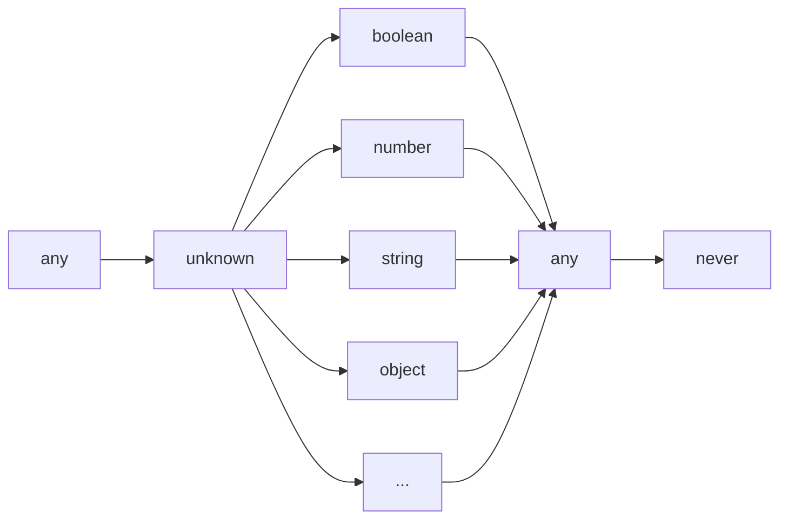

# 我在 typescript 写柯里化用到的类型经验

- [我写了个库，但本文重点不是它](#我写了个库但本文重点不是它)
- [只是一些朴实的技巧](#只是一些朴实的技巧)
- [说一下 any 、never 、unknown](#说一下-any-never-unknown)
  - [any](#any)
  - [never](#never)
  - [unknown](#unknown)
- [派生图谱](#派生图谱)
- [类型断言](#类型断言)
  - [有可能兼容的 as](#有可能兼容的-as)
  - [不可能兼容的 as](#不可能兼容的-as)
- [extends](#extends)
  - [泛型约束的 extends](#泛型约束的-extends)
  - [条件类型表达式约束的 extends](#条件类型表达式约束的-extends)
  - [一个类型派生于它本身](#一个类型派生于它本身)
- [infer](#infer)
  - [提取局部类型](#提取局部类型)
  - [提取整体类型](#提取整体类型)
  - [条件类型表达式一定是个三元表达式](#条件类型表达式一定是个三元表达式)
  - [条件类型不是类型](#条件类型不是类型)
- [元组与函数形参](#元组与函数形参)
  - [IsFixedTuple](#isfixedtuple)

## 我写了个库，但本文重点不是它

我写了个库，[facade.ts](https://github.com/iplaylf2/facade.ts) ，可以把一个函数变成柯里化的函数。

``` typescript
$((x: string, n: number) => x.repeat(n))("Hello!")(3); 
// Hello!Hello!Hello!
```

就像 [ramda](https://github.com/ramda/ramda) 那样，但是本身是类型安全的，而要做到那样的效果需要在类型体操上花点精力。

我想分享一下这过程中总结的类型经验，顺便推广一下自己的库，这就是本文的来由。

## 只是一些朴实的技巧

其实我不太愿意用体操这个词，至少题目没用到。typescript 的类型操作很多都有文档出处，虽然也有特例，但常规操作的组合就能满足大部分需求。

这并不是奇技淫巧，本文将要介绍的只是一些朴实的技巧，并且会尽量链接相关知识的出处。

## 说一下 any 、never 、unknown

做体操会大量用到 [条件类型表达式（ Conditional Types ）](https://www.typescriptlang.org/docs/handbook/2/conditional-types.html) 的特性，和与之深深关联的 extends 关键字。

在这之前，有 3 个类型更需要先弄明白，any 、never 、unknown 。

### any

“遇事不决用 any ”，“ AnyScript ”，想必很多人都听说过。

[any](https://www.typescriptlang.org/docs/handbook/2/everyday-types.html#any) 类型的变量，能赋值给所有类型的变量，也能接受所有类型的值。

``` typescript
let x: any = 233;
const foo: string = x;
x = false;
```

复用别的面向对象语言的经验，子类总是向上兼容基类。有人会以，“ any 是所有类型的基类也是所有类型的子类”，去方便理解 any 。

可是官方文档除了介绍 class 时，没有基类和子类这般说法，像“继承”用到的 extends 关键字也能翻译成“扩展”。

或许，我们可以借用 [Type Assertions](https://www.typescriptlang.org/docs/handbook/2/everyday-types.html#type-assertions)（ as 或 <> ）提到的**更具体的**和**更抽象的**去表达类型之间的关系。
> TypeScript only allows type assertions which convert to a more specific or less specific version of a type.

更具体的类型总是向上[兼容](https://www.typescriptlang.org/docs/handbook/type-compatibility.html#advanced-topics)它更抽象的版本。

那么，姑且在这定义 any 是所有类型的最具体和最抽象的版本。所以 any 类型的变量，能赋值给所有类型的变量，也能接受所有类型的值。

**啊不！！！any 有一个类型的变量不能去赋值，那就是 never ！**

```typescript
let x: any = 233;
const bar: never = x;
// 不能将类型“any”分配给类型“never”。ts(2322)
```

### never

[never](https://www.typescriptlang.org/docs/handbook/2/functions.html#never) 才是所有类型最具体的版本，包括 any 。

```typescript
declare const x: never;
const foo: string = x;
const bar: number = x;
const qux: any = x;
```

具体的类型能够兼容抽象的版本，所以在这个例子中，never 的 x 可以赋值给不同类型的变量。

虽然 never 的语义是不可到达，不可得到的类型，但它的确是上文所述的最具体的类型。而这种奇怪的属性，会在后面的类型操作中制造巨大的麻烦。

### unknown

与 never 相反，[unknown](https://www.typescriptlang.org/docs/handbook/2/functions.html#unknown) 是所有类型最抽象的版本，其他类型都是基于 unknown 更具体的版本。

好拗口，具体的类型派生于抽象的类型，这里直接沿用术语派生（ derive ）吧。所有类型都派生于 unknown 。以及 never 派生于所有类型。

```typescript
let x: unknown = 233;
x = false;
```

而在这个例子中，不同类型的值都能赋值给 unknown 的 x 。

**等等！两个最抽象的类型？any 和 unknown 都是最抽象的？**

``` typescript
const x: unknown = 233;
const foo: any = x;
const bar: unknown = foo;
```

为什么不能有两个“最”？再说了， any 都那么特殊了，再当次特例不奇怪。~~（摆烂。）~~

## 派生图谱

有了上面的认识，我们可以画一张 typescript 类型的派生图谱。

为了简化关系，这里把 any 作为 unknown 更抽象的版本，unknown 派生于 any。反正不会破坏 unknown 的性质。



箭头的方向就是派生的方向。

## 类型断言

类型断言也就是我们常用的 as ，有了派生图谱，就可以更容易地去理解它。

### 有可能兼容的 as

as 只能把一个值的类型转化成比它更具体或者更抽象的版本。

```typescript
const x: number = 233;
const foo = x as unknown; // 转化成更抽象的版本
const bar = x as never; // 转化成更具体的版本
```

从派生图谱上看，在同一条不折返的派生路径上的两个类型，可以通过 as 进行互相转化。

这条路径上的类型总是向上兼容的，as 的结果可能是兼容的，但不一定是正确的。我们可以看下面的例子。

```typescript
interface Animal {
  name: string;
}

// Cat 派生于 Animal
interface Cat extends Animal {
  climbTree(): void;
}

const azhu = { name: "azhu", climbTree(): void {} } as Animal; // 转化成更抽象的版本
azhu.climbTree(); // Animal 没有 climbTree 字段，编译不通过
const azhu_cat = azhu as Cat; // 转化成更具体的版本
azhu_cat.climbTree(); // 来自 azhu 的值有 climbTree 字段，兼容的类型不会直接导致运行出错

const foo: Animal = { name: "foo" };
const foo_cat = foo as Cat; // 转化成更具体的版本
foo_cat.climbTree(); // 来自 foo 的值没有 climbTree 字段，不兼容的类型直接导致了运行出错
```

一个抽象的类型的值，如果来自于它更具体的类型，才有可能在转化成更具体的版本时保持兼容。

### 不可能兼容的 as

如果是不可能兼容的类型之间使用 as ，则编译会报错。

```typescript
const x: number = 233;
const foo = x as string;
// 类型 "number" 到类型 "string" 的转换可能是错误的，因为两种类型不能充分重叠。如果这是有意的，请先将表达式转换为 "unknown"。ts(2352)
```

从派生图谱的角度来看，如果两个类型不在同一条不折返的派生路径上，他们之间就不存在派生关系，也就是不可能兼容的。

上述例子的报错信息，提示可以先把 number 转化成 unknown 。unknown 是大家共同的抽象类型，就能间接转化另一条路径上的类型。

```typescript
const x: number = 233;
const foo = x as unknown as string; // 编译能通过
```

## extends

有了上述概念的铺垫，我们回过头来看 extends 这个关键字。

extends 出现在 typescript 的 4 种场景之中。

- Class 的[继承](https://www.typescriptlang.org/docs/handbook/2/classes.html#extends-clauses)
- Object Types 的[派生](https://www.typescriptlang.org/docs/handbook/2/objects.html#extending-types)
- 泛型[约束](https://www.typescriptlang.org/docs/handbook/2/generics.html#generic-constraints)
- 条件类型表达式[约束](https://www.typescriptlang.org/docs/handbook/2/conditional-types.html)

每种场景的 extends 作用不同，但它们具有相同的语义——派生。而且，extends 左边的元素总是更具体的类型，右边的元素总是更抽象的类型。

这里主要认识一下在*泛型约束*和*条件类型表达式约束*它们之中的 extends 。

### 泛型约束的 extends

如果你的项目中使用了 typescript-eslint ，那么用到 Function 类型时有可能会[报错](https://typescript-eslint.io/rules/ban-types/#default-options)。它给出了两个理由。

- Function 没有约束参数和返回值，它不是类型安全的。
- Function 也是构造函数的抽象类型，如果我们不用 new 去调用一个构造函数，会有不可预测的后果。

我们可以定义一个 BaseFunction 去表达一个普通的函数，而且它不是一个构造函数。

```typescript
type BaseFunction<Params extends unknown[], Return> = (
  ...args: Params
) => Return;
```

在这里，泛型参数列表中的 extends ，起到了泛型约束的作用。

`Params extends unknown[]` ，用前文的概念去解释就是，（更）具体的类型 Params **派生于**（更）抽象的类型 unknown[] 。

在接下来的上下文中，Params 是 unknown[] 的具体类型，它兼容 unknown[] ，具有 unknown[] 的一切特性。

作为代价，实际传入 Params 的参数需要接受类型的约束，它必须派生于 unknown[] 。

在[函数类型表达式](https://www.typescriptlang.org/docs/handbook/2/functions.html#function-type-expressions) `(...args: Params) => Return` 中，args 是一个 [rest 参数](https://www.typescriptlang.org/docs/handbook/2/functions.html#rest-parameters-and-arguments)，它的类型必须是数组。

而 args 的类型 Params ，是 unknown[] 的具体类型，因此满足了 rest 参数的条件。

再者，另一个泛型参数 Return 类型，它没有泛型约束，可以是任意类型，在类型表达式中也没有受到限制。

最终我们就得到了一个合法的 BaseFunction 类型。

```typescript
const repeat: BaseFunction<[string, number], string> = (a, b) => a.repeat(b); // 编译通过

class Foo {
  constructor(public name: string) {}
}

const new_foo: BaseFunction<[string], Foo> = Foo; // 编译不通过
```

如果要表达构造函数，需要使用[构造签名](https://www.typescriptlang.org/docs/handbook/2/functions.html#construct-signatures) `new (...args: Params) => Instance` ，这里就不赘述了。

### 条件类型表达式约束的 extends

有了 BaseFunction ，我们可以再造一个 IsBaseFunction 来判断一个类型是不是普通的函数。

```typescript
type IsBaseFunction<T> = T extends BaseFunction<any, any> ? true : false;
```

在这里的 extends ，起到了条件类型表达式约束的作用。

`T extends BaseFunction<any, any>` 声明了一个约束，具体类型 T **派生于**抽象类型 BaseFunction\<any, any\> 。如果满足这个约束，就会采用第一个分支 `true` 的计算结果作为 IsBaseFunction\<T\> 的类型，否则采用第二个分支 `false` 的结果。

```typescript
type test1 = IsBaseFunction<{}>; // 类型 test1 为 false
type test2 = IsBaseFunction<() => void>; // 类型 test2 为 true
```

### 一个类型派生于它本身

还有一点需要补充一下，一个类型派生于它本身。我们可以用条件类型表达式来验证一下。

```typescript
type test1 = number extends number ? true : false; // 类型 test1 为 true
type test2 = { x: string } extends { x: string } ? true : false; // 类型 test2 为 true
```

（*条件类型表达式，在没有未知的泛型类型参数时，在信息足够时，能够立刻计算出结果。*）

“一个类型派生于它本身”，这个说法听起来怪怪的，或许用 [assignability](https://www.typescriptlang.org/docs/handbook/type-compatibility.html#advanced-topics) 比派生更合适，但是我不知道怎么翻译。

## infer

[infer](https://www.typescriptlang.org/docs/handbook/2/conditional-types.html#inferring-within-conditional-types) 关键字是条件类型表达式的另一大利器，用于提取抽象类型的局部类型或整体类型。

### 提取局部类型

这里可以参考 typescript 内置的 Parameters 的定义。

Parameters 能够返回一个函数类型中的参数类型。

```typescript
type Parameters<T extends (...args: any) => any> = T extends (
  ...args: infer P
) => any
  ? P
  : never;
```

条件类型表达式没有预设具体类型一定要派生于抽象类型，我们这次分析完全可以忽略泛型约束部分，来减少可能的干扰项。

```typescript
type Parameters<T> = T extends (...args: infer P) => any ? P : never;
```
（*这样的改动并不会影响 Parameters 的结果。*）

`T extends (...args: infer P) => any` 声明一个约束，具体类型 T 派生于抽象类型 (...args: infer P) => any 。

在抽象类型的表达式中，infer 将参数列表 args 的类型**提取为** P 。P 会尽量具体，或者说，P 将会和 T 在兼容该抽象类型时，与 T 的 args 类型相同。

如果满足这个约束，P 作为 Parameters\<T\> 的类型，否则为 never 。

```typescript
type test1 = Parameters<(a: string, b: number) => boolean>; // test1 的类型为 [a: string, b: number]
```

### 提取整体类型

提取整体类型的情况比较少见，但也比较简单。

我们来定义一个类型 DoubleParameters ，获取 2 次参数列表的类型。

```typescript
type DoubleParameters<T extends (...args: any) => any> =
  Parameters<T> extends infer K ? [K, K] : never;
```

`Parameters<T> extends infer K` 声明一个约束，具体类型 Parameters\<T\> 派生于抽象类型 K 。

infer 将抽象类型整体提取为 K ，K 会尽量具体，K 就是具体类型 Parameters\<T\> 。

这里的条件类型表达式如同定义了一个变量，然后对变量进行了复用。

```typescript
type test1 = DoubleParameters<(x: string) => number>; // [[x: string], [x: string]]
```

### 条件类型表达式一定是个三元表达式

可以看到，上文的条件类型表达式例子之中，有泛型约束，表明左边的的具体类型必将派生于右边的抽象类型；有整体类型的提取，来表示右边的抽象类型将与左边的具体类型相同。

即使有足够的上下文信息，去证明条件类型表达式中的具体类型必将派生于抽象类型，条件类型表达式还是一个三元表达式，它还是需要声明第二条不可能抵达的 never 分支。

这或许能够改进，我们可以期待未来有更简单的结构。

### 条件类型不是类型

前文一直很冗长地称条件类型表达式，是因为条件类型表达式确实是个表达式，他能出现在所有类型表达式能出现的地方，条件类型表达式的计算结果就是类型。

```typescript
const foo: never extends boolean ? string : number = "233";
const bar = true as number extends unknown ? boolean : string;
type qux = NonNullable<233 extends number ? "qux" : false>;
```

那么标题的**条件类型**是什么？如果在定义一个泛型类型时，它在等号（ = ）右边的部分，直接是一个条件类型表达式，那么我们就称这个泛型类型为条件类型。

就如上面提到的 IsBaseFunction 、 Parameters 、 DoubleParameters ，它们都是条件类型。

为什么说条件类型不是类型？因为这种泛型类型，需要通过计算条件类型表达式的结果，才能得到最终的类型，而它的结果在得到泛型类型参数前往往是不可知的。

条件类型不是类型，它的结果才是类型。这会导致一个现象，那就是无法用 infer 提取一个抽象的条件类型的参数。如下面的例子所示。

``` typescript
type sth = (x: string) => number;

type foo = Parameters<sth> extends Parameters<infer K> ? K : never;

type qux<T extends (...args: any) => any> = Parameters<T> extends Parameters<
  infer K
>
  ? K
  : never;

type bar = qux<sth>;
```

上面这个例子，无论 foo 还是 bar，都得不到和 sth 一样的类型。

## 元组与函数形参

有了以上的概念，就能开始对 typescript 的类型进行一些复杂的操作了。

本文开头提到过，我写了一个操作函数的库 facade.ts 。我在其中主要是操作函数类型，而函数形参是操作最多的部分。为了使表达更直白，后文把函数形参称为参数列表。

前文提到过，参数列表的类型是数组，其实再往细里说，参数列表的类型是派生于数组的[元组](https://www.typescriptlang.org/docs/handbook/2/objects.html#tuple-types)。

作为参数列表的元组除了兼容数组，还有以下特点：
- 每一项元素都能拥有不同的类型。

```typescript
type foo = [number, boolean];
```

- 尾部的元素可以是允许缺省的。

```typescript
type foo = [number, boolean?, string?];
```

- 没有缺省的元素时,最后一个元素可以是一个 rest 数组。

```typescript
type foo = [number, ...boolean[]];
```

- 长度可以是固定的。

```typescript
type foo = [number, boolean?, string?]["length"]; // 1 | 2 | 3
type bar = number[]["length"]; // number
```

- 每一项元素都能有名字。

```typescript
type foo = [a:number, b?:boolean, c?:string];
```

### IsFixedTuple

柯里化函数要求作为原型的函数它的参数列表是固定的，可数的。于是我需要定义一个判断元组是否固定的条件类型 IsFixedTuple 。

```typescript
type IsFixedTuple<T extends unknown[]> = number extends T["length"]
  ? false
  : true;
```

原理很简单，元组的数量不是固定时，它的长度是类型 number。只需判断具体类型 T 的长度是否为 number，就能判断一个元组类型的长度是否固定。

在条件类型表达式中，需要用到具体类型 T 的 length 属性获得长度，在它的上下文中，T 需要具备数组的特性才能拥有 length 属性。于是我们可以通过泛型约束，声明具体类型 T 派生于某种数组的抽象类型。

为什么是 unknown[] ？因为泛型约束会限制传入 T 的实参类型，为了使 T 能接受所有种类的数组类型作为实参，所以使用了元素是最抽象类型的数组类型 unknown[] 。any[] 也行。

T["length"] 除了会得到 number ，还会得到各种 number 的数值[字面量类型](https://www.typescriptlang.org/docs/handbook/2/everyday-types.html#literal-types)，如前文中的 1 | 2 | 3 。number 类型兼容数值字面量类型，数值字面量类型都派生于 number，而 number 不派生于数值字面量。所以在使用 extends 的条件类型表达式中，要准确判断 T["length"] 是否为 number ，只能把 T["length"] 放在抽象类型的位置上，所以是 `number extends T["length"]` 。


