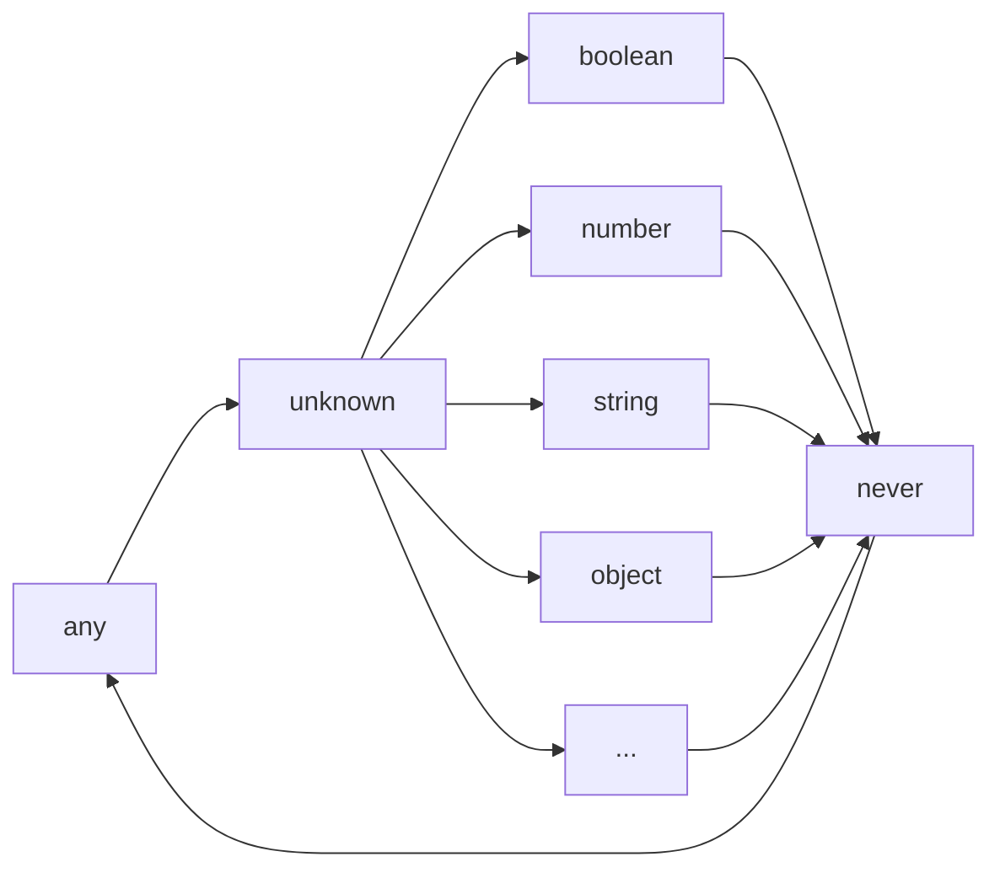

# 我在 typescript 写柯里化用到的类型经验

## 我写了个库，但本文重点不是它

我写了个库，[facade.ts](https://github.com/iplaylf2/facade.ts) ，可以把一个函数变成柯里化的函数。

``` typescript
$((x: string, n: number) => x.repeat(n))("Hello!")(3); 
// Hello!Hello!Hello!
```

就像 [ramda](https://github.com/ramda/ramda) 那样，但是本身是类型安全的，而要做到那样的效果需要在类型体操上花点精力。

我想分享一下这过程中总结的类型经验，顺便推广一下自己的库，这就是本文的来由。

## 只是一些朴实的技巧

其实我不太愿意用体操这个词，至少题目没用到。因为我看其他的类型体操文也会被劝退。

在这，我会尽量说一些简单朴实的技巧，尽量指出该技巧在官方文档的出处。

## 说一下 any 、 unknown 、 never

做体操会大量用到 [Conditional Types](https://www.typescriptlang.org/docs/handbook/2/conditional-types.html) 的特性，和与之深深关联的 extends 关键字。

在这之前，有 3 个类型更需要先弄明白，any 、unknown 、never 。

### any

“遇事不决用 any ”，“ AnyScript ”，想必很多人都听说过。

[any](https://www.typescriptlang.org/docs/handbook/2/everyday-types.html#any) 类型的变量，能赋值给所有类型的变量，也能接受所有类型的值。

``` typescript
let x: any = 233;
const foo: string = x;
x = false;
```

复用别的面向对象语言的经验，有人会以，“ any 是所有类型的基类也是所有类型的子类”，去方便理解它。

可是官方文档除了介绍 class 时，没有基类和子类这般说法，像“继承”用到的 extends 关键字也能翻译成“扩展”。

或许，我们可以用 [Type Assertions](https://www.typescriptlang.org/docs/handbook/2/everyday-types.html#type-assertions)（ as 或 <> ）提到的**更具体的**和**更抽象**的去表达类型之间的关系。
> TypeScript only allows type assertions which convert to a more specific or less specific version of a type.

那么，姑且在这定义 any 是所有类型的最具体和最抽象的版本。

如同向上兼容，类型总是兼容它更抽象的版本。所以 any 类型的变量，能赋值给所有类型的变量，也能接受所有类型的值。

### unknown

[unknown](https://www.typescriptlang.org/docs/handbook/2/functions.html#unknown) 是除了 any 之外最抽象的版本，其他类型都是基于 unknown 更具体的版本。

好拗口，具体的类型派生于抽象的类型，这里直接沿用术语派生（ derive ）吧。

any 以外的类型都派生于 unknown 。

```typescript
let x: unknown = 233;
x = false;
```

所以在这个例子中，不同类型的值也能赋值给 unknown 的 x 。

### never

[never](https://www.typescriptlang.org/docs/handbook/2/functions.html#never) 恰好是与 unknown 相反，他是 any 之外最具体的版本，它派生于所有其他类型。

```typescript
declare const x: never;
const foo: string = x;
const bar: number = x;
```

所以在这个例子中，never 的 x 可以赋值给不同类型的值。

虽然 never 的语义是不可到达，不可得到的类型，但它的确是上文所述的最具体的类型。

## 派生图谱

有了上面的认识，我们可以画一张 typescript 类型的派生图谱。



箭头的方向就是派生的方向。

## 类型断言

类型断言也就是我们常用的 as ，有了派生图谱，就可以更容易地去理解它。

### 有可能兼容的 as

as 只能把一个值的类型转化成比它更具体或者更抽象的版本。

```typescript
const x: number = 233;
const foo = x as unknown; // 转化成更抽象的版本
const bar = x as never; // 转化成更具体的版本
```

从派生图谱上看，在同一条不折返的派生路径上的两个类型，可以通过 as 进行互相转化。

这条路径上的类型总是向上兼容的，as 的结果可能是兼容的，但不一定是正确的。我们可以看下面的例子。

```typescript
interface Animal {
  name: string;
}

// Cat 派生于 Animal
interface Cat extends Animal {
  climbTree(): void;
}

const azhu = { name: "azhu", climbTree(): void {} } as Animal; // 转化成更抽象的版本
azhu.climbTree(); // Animal 没有 climbTree 字段，编译不通过
const azhu_cat = azhu as Cat; // 转化成更具体的版本
azhu_cat.climbTree(); // 来自 azhu 的值有 climbTree 字段，正确的类型不会直接导致运行出错

const foo: Animal = { name: "foo" };
const foo_cat = foo as Cat; // 转化成更具体的版本
foo_cat.climbTree(); // 来自 foo 的值没有 climbTree 字段，不正确的类型直接导致了运行出错
```

一个抽象的类型的值，如果来自于它更具体的类型，才有可能在转化成更具体的版本时保持兼容。

### 不可能兼容的 as

如果是不可能兼容的类型之间使用 as ，则编译会报错。

```typescript
const x: number = 233;
const foo = x as string;
// 类型 "number" 到类型 "string" 的转换可能是错误的，因为两种类型不能充分重叠。如果这是有意的，请先将表达式转换为 "unknown"。ts(2352)
```

从派生图谱的角度来看，如果两个类型不在同一条不折返的派生路径上，他们之间就不存在派生关系，也就是不可能兼容的。

上述例子的报错信息，提示可以先把 number 转化成 unknown 。unknown 是大家共同的抽象类型，就能间接转化另一条路径上的类型。

```typescript
const x: number = 233;
const foo = x as unknown as string; // 编译能通过
```

## extends

有了上述概念的铺垫，我们回过头来看 extends 这个关键字。

extends 出现在 typescript 的 4 种场景之中。

- Class 的[继承](https://www.typescriptlang.org/docs/handbook/2/classes.html#extends-clauses)
- Object Types 的[派生](https://www.typescriptlang.org/docs/handbook/2/objects.html#extending-types)
- 泛型[约束](https://www.typescriptlang.org/docs/handbook/2/generics.html#generic-constraints)
- 条件类型[约束](https://www.typescriptlang.org/docs/handbook/2/conditional-types.html)

每种场景的 extends 作用不同，但它们具有相同的语义——派生。而且，extends 左边的元素总是更具体的类型，右边的元素总是更抽象的类型。

本文的重点是后面 2 种场景，泛型约束和条件类型的约束。

### 泛型约束

如果你的项目中使用了 typescript-eslint ，那么用到 Function 类型时有可能会[报错](https://typescript-eslint.io/rules/ban-types/#default-options)。它给出了两个理由。

- Function 没有约束参数和返回值，它不是类型安全的。
- Function 也是构造函数的抽象类型，如果我们不用 new 去调用一个构造函数，会有不可预测的后果。

我们可以定义一个 BaseFunction 去表达一个普通的函数，而且它不是一个构造函数。

```typescript
type BaseFunction<Params extends unknown[], Return> = (
  ...args: Params
) => Return;
```

这里的 extends 起到了泛型约束的作用。

`Params extends unknown[]` ，用前文的概念去解释就是，（更）具体的类型 Params 派生于（更）抽象的类型 unknown[] 。

在接下来的上下文中，Params 是 unknown[] 的具体类型，它兼容 unknown[] ，具有  unknown[] 的一切特性。

作为代价，实际传入 Params 的参数需要接受类型的约束，它必须派生于 unknown[] 。

在[函数类型表达式](https://www.typescriptlang.org/docs/handbook/2/functions.html#function-type-expressions) `(...args: Params) => Return` 中，args 是一个 [rest 参数](https://www.typescriptlang.org/docs/handbook/2/functions.html#rest-parameters-and-arguments)，它的类型必须是数组或者[元组](https://www.typescriptlang.org/docs/handbook/2/objects.html#tuple-types)，否则编译就不会通过。

而 args 的类型 Params ，是 unknown[] 的具体类型，因此满足了 rest 参数的条件。

再者，另一个泛型参数 Return 类型，它没有泛型约束，可以是任意类型，在类型表达式中也没有受到限制。

最终我们就得到了一个合法的 BaseFunction 类型。

```typescript
const repeat: BaseFunction<[string, number], string> = (a, b) => a.repeat(b); // 编译通过

class Foo {
  constructor(public name: string) {}
}

const new_foo: BaseFunction<[string], Foo> = Foo; // 编译不通过
```

如果要表达构造函数，需要使用[构造签名](https://www.typescriptlang.org/docs/handbook/2/functions.html#construct-signatures) `new (...args: Params) => Instance` ，这里就不赘述了。

### 条件类型约束

有了 BaseFunction ，我们可以再造一个 IsBaseFunction 来判断一个类型是不是普通的函数。

```typescript
type IsBaseFunction<T> = T extends BaseFunction<any, any> ? true : false;
```

这里的 extends 就起到了条件类型约束的作用。

`T extends BaseFunction<any, any>` ，假设具体类型 T 派生于抽象类型 `BaseFunction<any, any>` 。如果满足这个约束，就会采用第一个表达式的结果作为类型，否则采用第二个的。

```typescript
type test1 = IsBaseFunction<{}>; // 类型 test1 为 false
type test2 = IsBaseFunction<() => void>; // 类型 test2 为 true
```

### 更复杂的场景


## tuple

给柯里化函数写类型，免不了处理函数类型。函数类型可以拆成两部分看待，参数列表和返回值，而参数列表往往是 [tuple](https://www.typescriptlang.org/docs/handbook/2/objects.html#tuple-types) 类型。

下面是 facade.ts 的一段代码